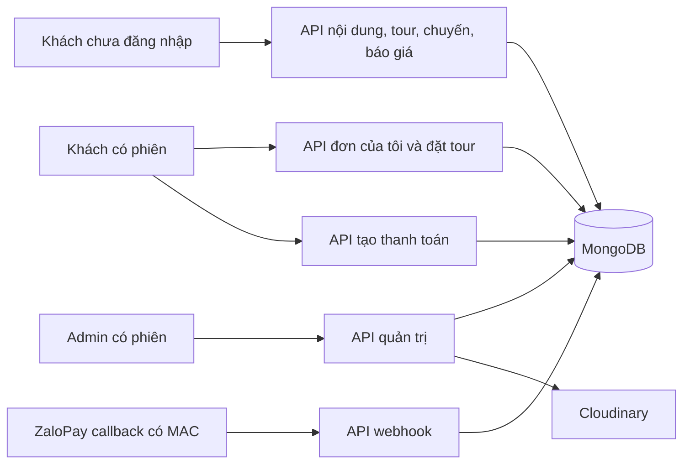
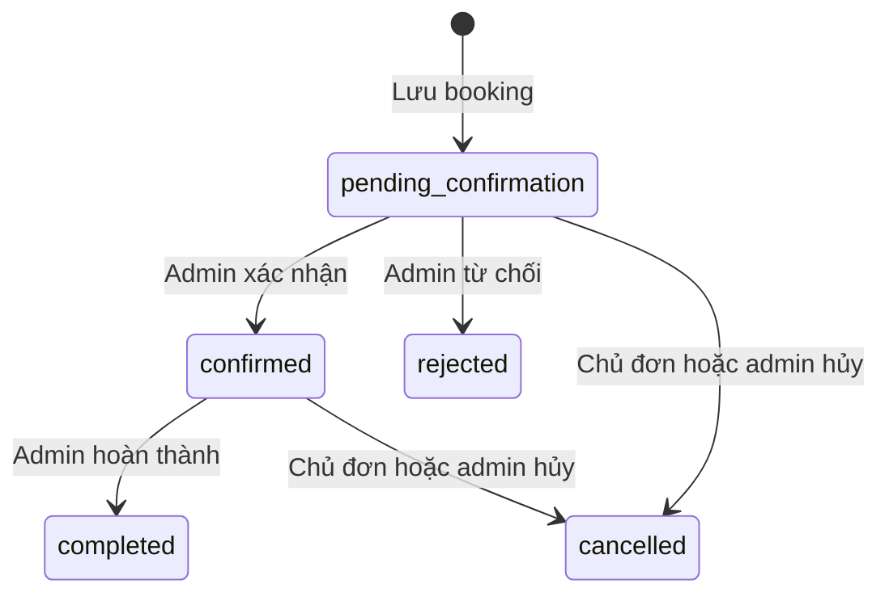

**VNA Đắk Song — Chức năng, role và logic backend**

Ngày đối chiếu: **08/10/2026, giờ Việt Nam**. Tài liệu mô tả mã đang có trong workspace, gồm cả thay đổi chưa commit. Đây là tài liệu đọc hiểu hệ thống; việc có mã tích hợp không đồng nghĩa dịch vụ bên ngoài đã được kiểm thử thành công.

**1. Backend đang phục vụ những việc gì?**

Backend dùng Node.js, Express và Mongoose để cung cấp API cho Mini App và trang quản trị. Nghiệp vụ chính gồm:

| Nhóm | Chức năng hiện có |
| --- | --- |
| Xác thực | Đăng nhập bằng Zalo, đăng nhập admin bằng email/mật khẩu, đăng nhập mock khi được bật ngoài production, đọc hồ sơ phiên hiện tại |
| Điểm đến | Danh sách, tìm kiếm, lọc, xem chi tiết; admin tạo, sửa, xuất bản và lưu trữ |
| Bài viết | Danh sách, tìm kiếm, lọc, xem chi tiết; quản lý nội dung, nguồn và điểm đến liên quan |
| Tour | Tìm kiếm, lọc, sắp xếp; khách lưu/bỏ lưu tour; admin quản lý chương trình, lịch trình, điểm đón và chính sách |
| Chuyến khởi hành | Quản lý ngày giờ, hạn nhận booking, giá người lớn/trẻ em và trạng thái nhận khách |
| Báo giá | Kiểm tra chuyến và số khách, tính giá tại server, áp voucher, cấp token báo giá có hạn |
| Coupon/voucher | Admin xem, tạo, sửa và xóa mã; backend kiểm tra thời hạn, quota, điều kiện giá trị đơn và mức giảm |
| Booking | Tạo đơn chờ xác nhận, chống gửi lặp, lưu thông tin tại lúc đặt, đọc đơn đúng chủ sở hữu |
| Xử lý đơn | Khách hủy đơn của mình đang chờ hoặc đã xác nhận; admin xác nhận, từ chối, hủy hoặc hoàn thành đơn; lưu lịch sử |
| Thanh toán | Tạo giao dịch ZaloPay, lưu giao dịch, kiểm tra callback và ghi nhận tiền về hoặc cần hoàn tiền |
| Thành viên | Cộng điểm khi hoàn thành booking, nâng hạng Bạc/Vàng/Kim Cương |
| Dashboard | Đếm đơn theo trạng thái, tour/điểm đến xuất bản, chuyến mở; tổng giá trị đơn đã xác nhận/hoàn thành |
| Hình ảnh | Admin upload ảnh lên Cloudinary |
| Công cụ vận hành | Script tạo admin và script seed dữ liệu mẫu |

Luồng dữ liệu được tổ chức theo `routes → controllers → models`. Quyền truy cập được kiểm tra bằng middleware và các điều kiện trong controller.



**2. Các role và tác nhân**

Trong collection User, trường `role` chỉ có **`user` và `admin`**. Khách chưa đăng nhập, ZaloPay và người chạy script là các tác nhân khác, không phải role lưu trong database.

| Role/tác nhân | Danh tính được xác định thế nào? | Phạm vi |
| --- | --- | --- |
| Khách chưa đăng nhập | Không có JWT | Xem nội dung xuất bản, xem tour/chuyến đang nhận yêu cầu, lấy báo giá, gọi API đăng nhập |
| `user` | JWT hợp lệ, tài khoản còn `active` | Quyền công khai; lưu/bỏ lưu tour, tạo booking, đọc/hủy đơn của chính mình, thanh toán đơn của chính mình, xem hồ sơ |
| `admin` | JWT hợp lệ; backend đọc User có `role = admin` | Quản lý nội dung/tour/chuyến/coupon, đọc toàn bộ booking, xử lý trạng thái đơn, dashboard, upload ảnh |
| ZaloPay webhook | MAC hợp lệ bằng key2; đối chiếu app và giao dịch | Ghi nhận thanh toán qua endpoint webhook; không dùng JWT của khách |
| Người vận hành | Chạy script với cấu hình môi trường/database | Tạo tài khoản admin hoặc chạy seed; không có API đăng ký admin công khai |

Hạng **Bạc, Vàng, Kim Cương** là hạng thành viên, không phải role phân quyền. Mock login cũng không phải role riêng: tài khoản được tạo qua mock mặc định là `user`.

**3. Ma trận quyền thực tế**

| Hành động | Chưa đăng nhập | `user` | `admin` |
| --- | --- | --- | --- |
| Xem điểm đến/bài viết/tour | Chỉ `published` | Chỉ `published` | Xem cả draft/published/archived; lọc trạng thái được |
| Xem chuyến của một tour | Tour published; chuyến mở, chưa hết hạn, chưa khởi hành | Như khách chưa đăng nhập | Xem cả chuyến đóng hoặc đã qua của tour tồn tại |
| Lấy báo giá | Có | Có | Có; vẫn phải là tour published và chuyến hợp lệ |
| Tạo booking | Không | Có | Có, booking gắn với chính tài khoản admin gọi API |
| `GET /api/bookings/mine` | Không | Đơn của mình | Đơn của mình |
| `GET /api/bookings` | Không | Controller tự giới hạn đơn của mình | Toàn bộ đơn |
| Xem chi tiết booking | Không | Chỉ đơn của mình | Mọi đơn tồn tại |
| Hủy qua `/:id/cancel` | Không | Đơn của mình đang pending hoặc confirmed | Cũng chỉ đơn của mình đang pending hoặc confirmed |
| Đổi trạng thái qua `/:id/status` | Không | Không | Mọi đơn, theo bảng chuyển trạng thái |
| Tạo giao dịch thanh toán | Không | Chỉ đơn của mình đủ điều kiện | Cũng chỉ đơn của mình; không có ngoại lệ thanh toán thay khách |
| Lưu/bỏ lưu và xem tour đã lưu | Không | Danh sách của mình; tour phải published | Cũng danh sách của mình; chỉ tour published |
| Tạo/sửa/lưu trữ nội dung, tour | Không | Không | Có |
| Quản trị chuyến khởi hành | Không | Không | Có |
| Xem/tạo/sửa/xóa coupon | Không | Không | Có; xóa là xóa document khỏi database |
| Dashboard, upload ảnh | Không | Không | Có |
| Gọi webhook | Không dựa trên phiên | Không dựa trên phiên | Không dựa trên phiên; MAC và giao dịch mới quyết định |

Admin muốn hủy đơn của khách phải dùng endpoint đổi trạng thái dành cho admin. Endpoint hủy của khách không tự mở rộng quyền khi người gọi là admin.

**4. Xác thực và phiên đăng nhập**

Nguồn: [authController.js](<backend/controllers/authController.js>), [authMiddleware.js](<backend/middlewares/authMiddleware.js>), [User.js](<backend/models/User.js>).

**Đăng nhập Zalo**

1. Client gửi `accessToken`; backend kiểm tra là chuỗi không rỗng, không chứa ký tự xuống dòng.
2. Thiếu `ZALO_APP_SECRET` hoặc JWT secret ngắn hơn 32 ký tự thì trả 503.
3. Backend gọi Zalo Graph lấy `id,name,picture`, gửi access token và HMAC `appsecret_proof`; timeout 8 giây.
4. Lỗi liên lạc trả 502; Zalo không xác nhận phiên hoặc ID sai định dạng trả 401.
5. Backend tìm hoặc tạo User theo `zaloId`, cập nhật tên/avatar. User mới có role `user`, `active = true`.
6. Tài khoản đã khóa không được đăng nhập; backend giữ role đang có khi cập nhật hồ sơ.
7. Trả User và JWT phiên. Client không được tự truyền role hoặc userId để cấp quyền.

**Đăng nhập admin**

1. Nhận email và password.
2. Email được trim và chuyển chữ thường; password phải là chuỗi không rỗng, tối đa 72 byte.
3. Chỉ tìm tài khoản có email tương ứng, role admin và active.
4. So sánh password với hash bằng bcrypt; sai thông tin trả 401.
5. Trả cùng dạng phiên như đăng nhập Zalo.

**Đăng nhập mock**

1. Trả 403 khi `NODE_ENV === production` hoặc `ALLOW_MOCK_LOGIN` không đúng bằng chuỗi `true`. Mặc định không bật mock nếu thiếu cấu hình này.
2. Nhận tên và số điện thoại dạng chuỗi; điện thoại được trim, cắt tối đa 20 ký tự.
3. Danh tính thử nghiệm là `mock_` cộng số điện thoại.
4. Tìm/tạo User và cấp JWT như phiên thông thường; không có OTP hoặc xác minh sở hữu số điện thoại.

**Quy tắc JWT và middleware**

| Thành phần | Hành vi |
| --- | --- |
| JWT phiên | Thuật toán HS256; issuer `vna-daksong-api`; audience `session`; `sub` là ID User; hạn 1 ngày |
| `protect` | Yêu cầu `Authorization: Bearer <token>`; kiểm tra token, ID, User tồn tại và active; gán User vào `req.user` |
| `adminOnly` | Kiểm tra `req.user.role === admin`; sai quyền trả 403 |
| `optionalProtect` | Không có Authorization thì cho xem công khai; nếu có thì bắt buộc token hợp lệ, kể cả endpoint đọc công khai |
| Hồ sơ | `GET /api/auth/me` trả User từ phiên đã xác minh |
| Mật khẩu | Mặc định không select password; chuyển User sang JSON luôn xóa password |

Backend chưa có API refresh token, logout/revoke token riêng, đổi/quên mật khẩu, quản lý role hoặc khóa User qua HTTP. Trường `active` đã có và middleware kiểm tra, nhưng chưa có endpoint quản trị nó.

**5. Các model dữ liệu**

| Model | Dữ liệu chính | Liên kết và quy tắc đáng chú ý |
| --- | --- | --- |
| User | Tên, Zalo ID, email, password hash, avatar, role, active, savedTours, điểm và hạng | Zalo ID/email unique và sparse; Zalo ID immutable; role chỉ user/admin; không có trường phone riêng |
| Destination | Tên, slug, tóm tắt, mô tả, category, địa chỉ, ảnh, nguồn, lưu ý, status | Slug unique; category nature/culture/food/history |
| Article | Tiêu đề, slug, tóm tắt, content, category, destinationIds, ảnh, nguồn, status | Liên kết Destination; category culture/food/travel_tips/story; slug unique |
| Tour | Tên, slug, mô tả, thời lượng, themes, destinationIds, itinerary, ảnh, điểm đón, bao gồm/chưa gồm, chính sách, status, soldCount | Thời lượng 1–720 giờ; mỗi điểm dừng có thể trỏ đến Destination; soldCount mặc định 0 |
| Departure | tourId, giờ khởi hành, hạn booking, giá người lớn/trẻ em, giới hạn khách mỗi booking, status | tourId immutable; giá nguyên từ 0 đến 1 tỷ VND; childPrice có thể null; hạn booking phải trước giờ đi |
| Booking | Mã đơn, userId, tourId, departureId, số khách, liên hệ, ghi chú, snapshot, trạng thái, phương thức thanh toán, voucher, history, khóa chống lặp | Các ID chủ sở hữu/tour/chuyến immutable; code unique; unique theo cặp userId + idempotencyKey |
| Coupon | Mã, loại và mức giảm, trần giảm, giá trị đơn tối thiểu, thời gian áp dụng, quota, số lần dùng, active | Mã chuyển chữ hoa, unique; usageLimit là số nguyên không âm hoặc null; usedCount nguyên không âm |
| PaymentTransaction | bookingId, bookingCode, appTransId, amount, provider, status, rawCallback, paidAt, note | appTransId unique; provider hiện chỉ zalopay; có index bookingId + status nhưng không unique theo cặp này |

Các model đều lưu `createdAt` và `updatedAt`. User, Destination, Article, Tour, Departure và Booking bật optimistic concurrency cho luồng lưu document; điều này không tự biến nhiều thao tác trên nhiều collection thành một transaction.

Ảnh nội dung lưu `url`, `alt`, `credit`. Nguồn nội dung lưu `title`, `url`, `checkedAt`. URL ảnh/nguồn chỉ nhận giao thức HTTP/HTTPS. Điện thoại liên hệ của booking được giới hạn 20 ký tự; controller chưa kiểm tra đầy đủ định dạng số điện thoại.

**Thông tin được chụp lại trong booking — snapshot**

| Trường | Ý nghĩa |
| --- | --- |
| tourName, departureAt, meetingPoint | Tên tour, giờ đi và điểm đón tại lúc đặt |
| childPolicy, cancellationPolicy | Chính sách áp dụng tại lúc đặt |
| adultPrice, childPrice | Đơn giá tại lúc đặt |
| subTotal, discountAmount, appliedCoupon | Giá gốc, tiền giảm và mã thực sự áp dụng |
| total, currency | Tổng tiền cuối cùng và VND |
| durationHours | Thời lượng tour được lưu ở bước báo giá/tạo đơn; dùng để tính giờ kết thúc. Đơn cũ chưa có trường này được schema mặc định null |

Snapshot giúp đơn cũ giữ giá và các thông tin đã lưu khi admin đổi tour/chuyến sau này. Snapshot hiện chưa lưu toàn bộ lịch trình, includes/excludes hoặc ảnh tour.

**6. Điểm đến, bài viết và quản lý xuất bản**

Nguồn: [destinationController.js](<backend/controllers/destinationController.js>), [articleController.js](<backend/controllers/articleController.js>).

| Nội dung | Điểm đến | Bài viết |
| --- | --- | --- |
| Tìm kiếm | `q`, dùng text search | `q`, dùng text search |
| Lọc | category; admin thêm status | category, destinationId; admin thêm status |
| Danh sách | Bỏ mô tả dài `description`; mới nhất trước | Bỏ nội dung dài `content`; mới nhất trước |
| Chi tiết | Tra bằng MongoDB ID | Tra bằng MongoDB ID |
| Tạo/sửa | Admin, kiểm tra trường dữ liệu và slug | Admin; thêm kiểm tra điểm đến liên quan tồn tại, chưa archived |
| Xuất bản | Controller yêu cầu ít nhất một nguồn | Controller yêu cầu ít nhất một nguồn |
| Xóa | Đổi status thành archived | Đổi status thành archived |

Ba trạng thái nội dung là `draft`, `published`, `archived`; mặc định draft. Khách thường chỉ đọc được published. Admin không truyền status khi lấy danh sách sẽ thấy tất cả trạng thái.

Slug dùng chữ thường, chữ số và dấu gạch ngang; backend không tự sinh slug. Endpoint chi tiết dùng ID, chưa có endpoint tra nội dung bằng slug.

Text index hiện đã được khai báo: Destination theo name/summary/description; Article theo title/summary/content. Việc index thực sự có trên database triển khai vẫn cần xác minh tại môi trường đó.

Lưu trữ nội dung không xóa dây chuyền các tour/bài viết/chuyến/booking liên quan. Controller tạo/sửa hiện kiểm tra nguồn là mảng không rỗng khi published. Quy tắc này chưa được đặt thành điều kiện xuất bản tại schema, nên luồng ghi trực tiếp model như seed không tự chịu cùng điều kiện.

**7. Tour: chương trình, tìm kiếm và giá hiển thị**

Nguồn: [tourController.js](<backend/controllers/tourController.js>), [Tour.js](<backend/models/Tour.js>).

Tour là chương trình du lịch; Departure là một lần khởi hành cụ thể. Giá đặt khách lấy từ Departure, không có một giá đặt chung cố định trong Tour.

| Tham số danh sách tour | Cách xử lý |
| --- | --- |
| q | Text search trên name/summary/description; model đã khai báo text index |
| status | Chỉ admin được chọn draft/published/archived; khách luôn bị giới hạn published |
| destinationId | Tour có điểm đến tương ứng |
| theme | nature, culture, food hoặc history |
| maxDurationHours | Tour có thời lượng không vượt giá trị yêu cầu, trong khoảng 1–720 |
| dateFrom, dateTo | Lọc giờ khởi hành của các Departure còn nhận yêu cầu |
| minPrice, maxPrice | Lọc giá người lớn của các Departure còn nhận yêu cầu |
| sort | newest, duration, price_asc, price_desc hoặc most_bought |
| page, limit | Phân trang; mặc định 1 và 10; tối đa 100 bản ghi/trang |

Server ghép Tour với các Departure open, chưa hết hạn booking và chưa khởi hành. `priceFrom` là giá người lớn thấp nhất trong các chuyến phù hợp bộ lọc; `hasUpcomingDeparture` cho biết có chuyến phù hợp hay không.

Nếu có lọc ngày hoặc giá, tour phải có ít nhất một chuyến phù hợp mới được trả về. Nếu không lọc ngày/giá, tour published chưa có chuyến vẫn có thể xuất hiện với `priceFrom = null`. Danh sách bỏ `description`, danh sách chuyến ghép tạm và `bookingRevision` khỏi kết quả.

Khi tạo/sửa tour:

1. Admin cung cấp tên, slug, tóm tắt, mô tả, thời lượng, điểm đón và chính sách hủy.
2. Themes phải thuộc danh sách hỗ trợ.
3. Destination ID khai báo phải tồn tại và chưa archived; controller loại ID trùng.
4. Tour published phải có ít nhất một mục lịch trình.
5. Điểm đến của từng điểm dừng, nếu khai báo, phải nằm trong destinationIds của tour.
6. `DELETE` chuyển tour sang archived; không xóa đơn cũ hoặc tự hủy các booking đã có.

**Tour đã lưu**

1. `GET /api/tours/saved` cần phiên; đọc savedTours của User hiện tại, populate các Tour còn published và trả data. Chưa phân trang, chưa tính thêm priceFrom như API danh sách tour.
2. `POST /api/tours/:id/save` cần phiên và tour published. Tour chưa lưu thì thêm ID; đã lưu thì bỏ ID; trả message và isSaved.
3. Admin cũng dùng danh sách của chính mình. Tour bị lưu trữ sẽ không xuất hiện ở danh sách này; endpoint toggle cũng không nhận tour chưa published.
4. Endpoint save đang là toggle: gửi lại cùng request sẽ đảo trạng thái một lần nữa, chưa phải thao tác đặt isSaved cố định để retry an toàn.

**8. Chuyến khởi hành: lịch, giá và điều kiện nhận booking**

Nguồn: [departureController.js](<backend/controllers/departureController.js>), [Departure.js](<backend/models/Departure.js>).

| Quy tắc | Hành vi hiện tại |
| --- | --- |
| Một tour nhiều chuyến | Mỗi Departure trỏ về một Tour |
| Trạng thái | open hoặc closed; mặc định open |
| Giá người lớn | Bắt buộc, số nguyên không âm; schema giới hạn tối đa 1 tỷ VND |
| Giá trẻ em | Null nếu chưa có giá; nếu có phải là số nguyên không âm, tối đa 1 tỷ VND |
| Giới hạn khách | maxGuestsPerBooking từ 1–100, mặc định 20; đây là giới hạn cho từng đơn |
| Hạn nhận đơn | bookingDeadline phải trước departureAt |
| Tạo chuyến | Tour phải tồn tại và chưa archived; có thể tạo chuyến cho tour draft |
| Xem công khai | Đi qua `/api/tours/:id/departures`; tour published, chuyến open, chưa hết hạn và chưa khởi hành |
| Xem quản trị | `/api/departures` và `/:id` chỉ dành admin; có thể lọc tourId/status ở danh sách |
| Sắp xếp | Giờ khởi hành tăng dần |
| Sửa lịch | Không cho đổi departureAt nếu có booking pending_confirmation hoặc confirmed |
| Sửa giá/giới hạn/hạn đặt | Được sửa; giá đã lưu trong booking cũ giữ theo snapshot |
| Xóa chuyến | Chỉ chuyển thành closed, đóng nhận yêu cầu mới |

Backend chưa quản lý sức chứa tổng của chuyến, số chỗ còn lại, giữ chỗ hoặc trừ tồn chỗ. Không thể dùng maxGuestsPerBooking làm bằng chứng một chuyến còn chỗ.

Ngày giờ được parse bằng JavaScript Date. Chưa có quy tắc bắt buộc timezone/offset cho dữ liệu đầu vào hoặc cơ chế chốt ngày theo Asia/Ho_Chi_Minh tại controller.

**9. Báo giá: kiểm tra đầu vào và tính tiền ở server**

Nguồn: `getBookingQuote` trong [bookingController.js](<backend/controllers/bookingController.js>).

Endpoint báo giá công khai nhận departureId, adults, children và couponCode nếu có. Endpoint này không dùng protect/optionalProtect và không gắn báo giá với một User.

1. Kiểm tra departureId hợp lệ và tìm được chuyến/tour.
2. Adults phải là số nguyên 1–100; children là số nguyên 0–100, mặc định 0.
3. Tour phải published; chuyến phải open, chưa hết hạn nhận đơn và chưa khởi hành.
4. Tổng người lớn + trẻ em không vượt maxGuestsPerBooking.
5. Có trẻ em thì phải có childPrice và chính sách trẻ em của tour.
6. Tính giá gốc bằng giá trong Departure, sau đó áp Coupon hợp lệ.
7. Tạo snapshot, gồm cả durationHours; sắp xếp khóa object đệ quy trước khi tính hash SHA-256 của chuyến, số khách và snapshot.
8. Ký JWT báo giá với audience `quote`; khác audience của token đăng nhập.
9. Thời hạn báo giá tối đa 600 giây, đồng thời không vượt hạn booking của chuyến.
10. Trả bảng giá, quoteToken, expiresAt và thông báo chỗ còn chờ VNA xác nhận.

Công thức hiện có:

```text
subTotal = adultPrice × adults + (childPrice hoặc 0) × children
total = subTotal - discountAmount
```

Client không được tự quyết định giá bằng cách gửi tổng tiền. Quote token không phải token đăng nhập và không chứng minh chuyến đã giữ chỗ.

**10. Coupon: hiệu lực, giảm tiền và lượt sử dụng**

Nguồn: [Coupon.js](<backend/models/Coupon.js>), [couponController.js](<backend/controllers/couponController.js>), [couponRoutes.js](<backend/routes/couponRoutes.js>), phần quote/create/changeStatus của [bookingController.js](<backend/controllers/bookingController.js>).

**Quản trị mã giảm giá**

Toàn bộ `/api/coupons` được bảo vệ bằng protect và adminOnly; khách không có API xem danh sách coupon công khai.

| Thao tác | Logic hiện có |
| --- | --- |
| Danh sách | Lọc isActive; chỉ chuỗi `true` được hiểu là true, giá trị khác khi có gửi bộ lọc được hiểu là false. Sort newest mặc định hoặc oldest; page mặc định 1, limit 20, tối đa 100; trả data và pagination |
| Tạo | Code là chuỗi không rỗng, trim và chuyển chữ hoa; discountType là fixed/percentage; discountValue dạng number không âm, percentage không vượt 100; validUntil phải là ngày hợp lệ; mã trùng trả 400 |
| Giá trị mặc định khi tạo | description chuyển chuỗi và trim; maxDiscount không đạt điều kiện >= 0 thì null; minOrderValue tương ứng về 0; validFrom thiếu thì hiện tại; usageLimit không phải số nguyên an toàn không âm thì null; isActive thiếu thì true |
| Sửa | Kiểm tra ID và coupon tồn tại; cập nhật các trường được gửi, kiểm tra loại/mức giảm tương tự; không cho sửa code hay usedCount qua controller này; isActive được chuyển bằng Boolean |
| Xóa | Kiểm tra ID; findByIdAndDelete xóa hẳn coupon, không chỉ tắt isActive; không có kiểm tra booking đang dùng mã |

Chưa có API chi tiết coupon theo ID riêng, giới hạn lượt dùng theo từng User hoặc đổi điểm lấy voucher. Controller chưa kiểm tra validUntil phải sau validFrom. Một số đầu vào sai được chuyển về mặc định, lỗi ngày/validation ở bước save có thể trả 500; riêng update với isActive là chuỗi `false` vẫn chuyển thành true vì dùng Boolean. Xóa coupon không xóa mã/số tiền giảm đã lưu trong snapshot booking, nhưng sẽ mất document để quản lý quota của mã cũ.

**Áp dụng coupon vào báo giá và booking**

| Điều kiện | Quy tắc |
| --- | --- |
| Chuẩn hóa mã | Trim, chuyển chữ hoa trước khi tìm |
| Active | isActive phải true |
| Thời gian | Hiện tại phải nằm trong validFrom–validUntil |
| Quota | usageLimit null nghĩa là không giới hạn; nếu có thì usedCount phải nhỏ hơn usageLimit |
| Giá trị đơn | Dưới minOrderValue thì tiền giảm bằng 0 |
| fixed | Giảm theo discountValue |
| percentage | Lấy phần nguyên của subTotal × discountValue / 100; áp maxDiscount nếu có |
| Giới hạn tiền giảm | Luôn không âm, không vượt tổng đơn, làm tròn xuống số nguyên |
| Lấy báo giá | Chỉ tính giảm giá; chưa tăng usedCount |
| Tạo booking | Nếu thực sự áp dụng giảm tiền thì tăng usedCount trong transaction tạo booking |
| Hủy/từ chối | Đã có bước giảm usedCount theo couponCode trước khi đổi trạng thái booking |

Nếu gửi mã có giá trị truthy, bước quote kiểm tra kiểu chuỗi; mã không tồn tại, không còn hiệu lực/hết quota hoặc tiền giảm bằng 0 đều trả 400 với thông báo riêng. Bước tạo booking cũng trả 400 cho các trường hợp tương ứng. Giá trị falsy như chuỗi rỗng được coi như không dùng mã. Nếu đã dùng voucher ở quote thì khi tạo booking cần gửi lại couponCode phù hợp để bảng giá tính lại khớp hash.

Hoàn lượt voucher hiện chưa nằm trong transaction cùng thay đổi trạng thái booking, nên vẫn còn rủi ro khi lỗi hoặc có yêu cầu đồng thời. Nếu admin xóa rồi tạo lại cùng code, quota của document mới không tự liên kết với các booking cũ đang lưu code đó.

**11. Tạo booking, chống gửi lặp và lưu đơn**

Nguồn: `createBooking` và [Booking.js](<backend/models/Booking.js>).

| Đầu vào | Quy tắc |
| --- | --- |
| JWT phiên | Bắt buộc; userId lấy từ req.user |
| quoteToken | Bắt buộc là chuỗi; nếu tạo đơn mới phải hợp lệ và chưa hết hạn |
| contact | Có name và phone dạng chuỗi không rỗng; lưu sau khi trim |
| note | Chuỗi thì trim; kiểu khác hoặc thiếu được lưu chuỗi rỗng |
| couponCode | Tính lại voucher ở server |
| paymentMethod | qr_transfer, cash_on_arrival hoặc zalopay; thiếu/sai giá trị thì mặc định cash_on_arrival |
| Idempotency-Key | Header bắt buộc, ít nhất 8 ký tự; hiện chưa có giới hạn độ dài tối đa |

Trình tự xử lý:

1. Kiểm tra đầu vào cơ bản; chuẩn hóa name/phone bằng trim, note về chuỗi đã trim; thiếu couponCode/paymentMethod được biểu diễn bằng chuỗi rỗng trong requestHash. Các khóa object được sắp xếp đệ quy trước khi hash.
2. Tìm booking theo cặp User + Idempotency-Key. Nếu đã có và hash giống, trả đơn cũ với HTTP 200, `replayed = true`; không tạo thêm đơn và không cần báo giá cũ còn hạn.
3. Nếu cùng key nhưng hash khác, trả 409.
4. Với yêu cầu mới, xác minh quoteToken và bắt đầu transaction MongoDB.
5. Đọc chuyến; cập nhật bookingRevision và version của Tour published cùng Departure open, chưa hết hạn, chưa khởi hành. Các cập nhật này tham gia kiểm soát thay đổi đồng thời.
6. Kiểm tra lại số khách theo maxGuestsPerBooking hiện tại; vượt giới hạn trả 400. Đọc giá hiện tại, kiểm tra/tính lại coupon và cập nhật lượt dùng nếu được áp dụng.
7. Tính lại snapshot/hash. Khác hash đã ký thì hủy transaction, trả 409 để lấy báo giá mới.
8. Sinh mã `VNA-` cộng 12 ký tự hex ngẫu nhiên; lưu User, Tour, Departure, số khách, liên hệ, snapshot và lịch sử tạo đơn.
9. Booking bắt đầu ở `pending_confirmation`, controller gán paymentStatus `unpaid`.
10. Commit thành công mới trả HTTP 201 với `replayed = false`. Nếu gặp trùng unique key, controller thử tìm lại booking để trả kết quả replay hoặc conflict.

Các trường idempotencyKey và requestHash không được trả ra trong phản hồi tạo/replay; schema cũng ẩn chúng khỏi truy vấn thông thường.

Transaction tạo đơn gom các thay đổi trên Tour, Departure, Coupon và Booking. Môi trường database phải hỗ trợ transaction. Chức năng này không quản lý giữ chỗ theo sức chứa của chuyến.

Giới hạn khách và durationHours hiện đã được kiểm tra/lưu lại khi chốt đơn. Thứ tự khóa contact không còn làm đổi hash. Tuy nhiên couponCode chưa được trim/chuyển chữ hoa trong requestHash và paymentMethod chưa được đổi về giá trị mặc định thực tế trước khi hash; cùng ý nghĩa nghiệp vụ nhưng đổi cách gửi hai trường này vẫn có thể nhận 409 với key cũ.

**12. Đọc đơn, hủy đơn và admin xử lý trạng thái**

| API | Cách giới hạn dữ liệu |
| --- | --- |
| GET /api/bookings/mine | Luôn lấy userId từ phiên; lọc status; phân trang; mới nhất trước |
| GET /api/bookings | Admin đọc mọi đơn; User chỉ đơn của mình; lọc status, departureId và mã code chính xác |
| GET /api/bookings/:id | Admin đọc mọi đơn; User phải là chủ sở hữu; không tìm được trong phạm vi thì trả 404 |
| PATCH /api/bookings/:id/cancel | Chủ sở hữu tự hủy khi đang pending hoặc confirmed; bắt buộc reason |
| PATCH /api/bookings/:id/status | Admin chuyển trạng thái theo bảng dưới |

| Trạng thái hiện tại | Trạng thái mới | Ai được thực hiện? | Điều kiện thêm |
| --- | --- | --- | --- |
| pending_confirmation | confirmed | Admin | Không có kiểm tra paymentStatus ở luồng này |
| pending_confirmation | rejected | Admin | Có lý do từ chối |
| pending_confirmation | cancelled | Chủ đơn hoặc admin | Có lý do hủy |
| confirmed | cancelled | Chủ đơn hoặc admin | Có lý do hủy; hiện chưa kiểm tra hạn hủy theo chính sách tour |
| confirmed | completed | Admin | departureAt + durationHours trong snapshot không được nằm ở tương lai; thiếu thời lượng thì dùng 0 |
| completed/cancelled/rejected | Bất kỳ | Không có chuyển tiếp được hỗ trợ | Không có API mở lại đơn |



Khi đổi trạng thái, controller kiểm tra trạng thái hiện tại, rồi cập nhật với điều kiện status vẫn bằng trạng thái đã đọc. Không còn khớp thì trả 409. Mỗi lần đổi có history gồm status, actorId, reason và thời điểm; đồng thời tăng version.

Tác động kèm theo:

| Sự kiện | Tác động |
| --- | --- |
| Hủy hoặc từ chối đơn có voucher | Giảm Coupon.usedCount trước khi cập nhật booking |
| Xác nhận booking | Tăng Tour.soldCount bằng adults + children |
| Hủy booking đang confirmed | Giảm Tour.soldCount bằng adults + children |
| Hủy/từ chối booking đã paid | Đặt booking.paymentStatus thành refund_pending; chưa đồng bộ trạng thái PaymentTransaction trong nhánh này |
| Hoàn thành booking | Cộng điểm và xét hạng User; thử lưu User tối đa 2 lần nếu lỗi |

Các tác động kèm theo hiện không được gom vào một transaction. Nếu cả hai lần cộng điểm đều lỗi, controller ghi log CRITICAL nhưng vẫn trả booking đã cập nhật; không có job khôi phục điểm. API trạng thái chưa sửa được liên hệ, số khách, giá hoặc ngày của booking; cũng chưa có cơ chế khách đồng ý đề xuất đổi chuyến/đổi giá.

**13. Thanh toán ZaloPay và giao dịch**

Nguồn: [paymentController.js](<backend/controllers/paymentController.js>), [PaymentTransaction.js](<backend/models/PaymentTransaction.js>), [paymentRoutes.js](<backend/routes/paymentRoutes.js>).

Booking hiện có hai nhóm trạng thái độc lập trong schema:

| Nhóm | Giá trị |
| --- | --- |
| Trạng thái xử lý tour — status | pending_confirmation, confirmed, completed, cancelled, rejected |
| Trạng thái thanh toán — paymentStatus | unpaid, paid, refund_pending, refunded |
| Trạng thái giao dịch — PaymentTransaction.status | pending, success, failed, refund_pending, refunded |

`refunded` đã có trong schema nhưng chưa có API thực hiện hoàn tiền hoặc xác nhận hoàn tiền xong. Không có bảng chuyển tiếp đầy đủ cho paymentStatus trong backend hiện tại.

**Tạo giao dịch**

1. Middleware xác minh phiên; controller đọc cấu hình ZaloPay khi xử lý request. Thiếu app ID, key1, key2 hoặc endpoint thì trả 503.
2. Tìm booking, populate Tour và kiểm tra booking thuộc người gọi.
3. Chỉ chấp nhận booking pending_confirmation hoặc confirmed; chặn paymentStatus đã paid.
4. Nếu đã có PaymentTransaction pending của booking, trả 409 cùng appTransId đang chờ.
5. Sinh app_trans_id theo ngày từ Moment, mã booking và số ngẫu nhiên; amount lấy từ snapshot.total.
6. Tạo dữ liệu hàng hóa và redirecturl từ CLIENT_URL; ký HMAC SHA-256 bằng key1.
7. Lưu PaymentTransaction pending trước khi gọi nhà cung cấp.
8. Gọi ZaloPay qua Axios với tham số giao dịch đặt trong query params.
9. Nhà cung cấp trả return_code = 1 thì trả order_url, zp_trans_token và appTransId cho client.
10. Nhà cung cấp trả mã thất bại thì cập nhật transaction thành failed, lưu note và trả 400. Lỗi ném ra ngoài nhánh này được catch và trả 500.

**Nhận webhook**

1. Đọc cấu hình; lấy data và mac từ body.
2. Kiểm tra HMAC SHA-256 bằng key2.
3. Kiểm tra app_id khớp cấu hình.
4. Tìm PaymentTransaction theo app_trans_id đã lưu; không có thì từ chối.
5. Nếu transaction đã success, trả success ngay để tránh xử lý lại nhánh thành công.
6. Đối chiếu amount với transaction.amount; không khớp thì lưu failed và rawCallback.
7. Tìm booking theo bookingId trong transaction; không có thì ghi failed, lưu callback và trả success cho phía gửi.
8. Với booking tồn tại, lưu transaction success, paidAt và rawCallback.
9. Nếu booking đã cancelled/rejected, chuyển transaction và booking.paymentStatus thành refund_pending, thêm lịch sử cần hoàn tiền.
10. Với trạng thái booking khác, gán paymentStatus paid, paymentMethod zalopay, thêm lịch sử payment_received và tăng soldCount theo số khách.
11. **Webhook hiện không chuyển booking.status sang confirmed.** VNA vẫn xác nhận chuyến qua API quản trị.

Webhook dùng return_code trong JSON: 1 khi xử lý/đã xử lý thành công; -1 cho các trường hợp chữ ký/app/giao dịch/số tiền không hợp lệ; 0 khi lỗi xử lý hoặc thiếu cấu hình. Đây là cơ chế phản hồi riêng của webhook, không đồng nhất với HTTP status của API khách.

Lịch sử thanh toán đang dùng actorId là chủ booking; chưa có actor hệ thống riêng. Ngoài ZaloPay, qr_transfer và cash_on_arrival hiện mới là lựa chọn lưu trong booking, chưa có API xác nhận thu tiền mặt/chuyển khoản hoặc tự tạo QR ngân hàng.

**14. Điểm thành viên, soldCount và dashboard**

| Logic | Hành vi hiện có |
| --- | --- |
| Điểm thưởng | Khi admin chuyển confirmed → completed, cộng floor(snapshot.total / 10.000) điểm |
| Hạng ban đầu | Bạc |
| Nâng Vàng | Tổng loyaltyPoints từ 1.000 |
| Nâng Kim Cương | Tổng loyaltyPoints từ 5.000 |
| Điều kiện tiền | Chưa bắt buộc paymentStatus paid để hoàn thành hoặc cộng điểm |
| Lịch sử điểm | Chưa có collection/API ledger riêng cho cộng/trừ điểm |
| savedTours | Có API lấy tour đã lưu và toggle lưu/bỏ lưu; chỉ trả/cho thao tác với tour published |
| soldCount | Đếm số khách, không phải số booking; hiện được tăng ở cả xác nhận đơn và webhook thanh toán |

Dashboard dành admin chạy các truy vấn khi được gọi và trả:

| Trường phản hồi | Cách tính |
| --- | --- |
| bookings | Số booking nhóm theo status; trạng thái không có đơn có thể không xuất hiện trong object |
| tours | Số Tour published |
| destinations | Số Destination published |
| openDepartures | Số Departure open có bookingDeadline ở tương lai; không kiểm tra trạng thái Tour cha trong truy vấn đếm |
| totalRevenue | Tổng snapshot.total của các booking confirmed hoặc completed |

totalRevenue hiện là **tổng giá trị đơn được xác nhận/hoàn thành**, chưa chứng minh tiền đã thu, vì không lọc paymentStatus và không đối soát các giao dịch/hoàn tiền. Chưa có bộ lọc khoảng ngày, thống kê lượt truy cập, chuỗi số liệu theo thời gian hoặc cập nhật qua WebSocket.

**15. Upload, cấu hình server và xử lý lỗi**

**Upload ảnh**

1. Chỉ admin có phiên hợp lệ được gọi `POST /api/upload`.
2. Nhận một file multipart ở trường `image`; Multer giữ file trong memory.
3. Giới hạn 5 MB; bộ lọc kiểm tra MIME bắt đầu bằng image/.
4. Không có file trả 400.
5. Chuyển buffer sang data URI rồi upload lên folder vna-daksong trên Cloudinary.
6. Trả message, URL HTTPS và public_id; chưa có API xóa ảnh trên Cloudinary.

**Server**

| Thành phần | Hiện trạng |
| --- | --- |
| Nạp môi trường | server.js import dotenv/config ở đầu file; cấu hình thanh toán đọc lazy khi request |
| Kết nối DB | connectDB dùng MONGO_URI; lỗi kết nối thì process.exit(1) |
| Khởi động HTTP | PORT từ env, mặc định 8000; gọi connectDB nhưng chưa await trước app.listen |
| CORS | app.use(cors()), chưa áp allowlist theo CLIENT_URL |
| JSON | express.json dùng cấu hình mặc định |
| GET / | Trả tên dịch vụ; chưa kiểm tra database ready |
| Module app | server.js export app nhưng import file cũng kích hoạt kết nối DB và listen; chưa tách app.js |
| Đóng DB | config/db.js đã export disconnectDB để ngắt kết nối |

**Lỗi chung**

| Loại lỗi đi đến errorMiddleware | HTTP dự kiến |
| --- | --- |
| Không có API | 404 với NOT_FOUND |
| ValidationError/CastError/StrictModeError | 400 với VALIDATION_ERROR |
| Duplicate key 11000 | 409 với DUPLICATE_RECORD |
| VersionError | 409 với RECORD_CHANGED |
| Lỗi transaction có code 20 | 503 với TRANSACTIONS_REQUIRED |
| JSON không hợp lệ/quá lớn | 400 hoặc 413 |
| Lỗi khác | 500 với REQUEST_FAILED |

Nhiều controller tự catch và trả 500 kèm error.message, nên lỗi thực tế ở những nhánh đó không đi qua bảng xử lý chung. Phản hồi thành công cũng chưa thống nhất hoàn toàn: API chi tiết nội dung trả document trực tiếp, booking trả object data, danh sách trả data + pagination.

**16. Toàn bộ endpoint đang được mount**

Có **46 tổ hợp method + path dưới /api**, cộng **GET /** giới thiệu dịch vụ. PUT và PATCH được liệt kê riêng dù nhiều nơi dùng cùng controller.

Quy ước quyền: **Công khai** không bắt buộc JWT; **Phiên** là User hoặc admin có JWT hợp lệ; **Admin** cần thêm role admin; **MAC** là kiểm tra webhook ZaloPay.

| STT | Method | Path | Quyền/giới hạn | Chức năng |
| --- | --- | --- | --- | --- |
| 1 | POST | /api/auth/zalo | Công khai | Xác minh Zalo và cấp phiên |
| 2 | POST | /api/auth/admin/login | Công khai | Đăng nhập admin |
| 3 | POST | /api/auth/mock | Công khai khi ALLOW_MOCK_LOGIN=true và ngoài production | Cấp phiên thử nghiệm |
| 4 | GET | /api/auth/me | Phiên | Đọc hồ sơ |
| 5 | GET | /api/destinations | Công khai, optionalProtect | Danh sách/lọc/tìm kiếm điểm đến |
| 6 | GET | /api/destinations/:id | Công khai, optionalProtect | Chi tiết điểm đến theo phạm vi role |
| 7 | POST | /api/destinations | Admin | Tạo điểm đến |
| 8 | PUT | /api/destinations/:id | Admin | Sửa các trường được gửi |
| 9 | PATCH | /api/destinations/:id | Admin | Cùng controller với PUT |
| 10 | DELETE | /api/destinations/:id | Admin | Lưu trữ điểm đến |
| 11 | GET | /api/articles | Công khai, optionalProtect | Danh sách/lọc/tìm kiếm bài viết |
| 12 | GET | /api/articles/:id | Công khai, optionalProtect | Chi tiết bài viết theo phạm vi role |
| 13 | POST | /api/articles | Admin | Tạo bài viết |
| 14 | PUT | /api/articles/:id | Admin | Sửa bài viết |
| 15 | PATCH | /api/articles/:id | Admin | Cùng controller với PUT |
| 16 | DELETE | /api/articles/:id | Admin | Lưu trữ bài viết |
| 17 | GET | /api/tours | Công khai, optionalProtect | Danh sách/lọc/tìm kiếm/sắp xếp tour |
| 18 | GET | /api/tours/:id/departures | Công khai, optionalProtect | Chuyến của tour theo phạm vi role |
| 19 | GET | /api/tours/:id | Công khai, optionalProtect | Chi tiết tour |
| 20 | POST | /api/tours | Admin | Tạo tour |
| 21 | PUT | /api/tours/:id | Admin | Sửa tour |
| 22 | PATCH | /api/tours/:id | Admin | Cùng controller với PUT |
| 23 | DELETE | /api/tours/:id | Admin | Lưu trữ tour |
| 24 | GET | /api/departures | Admin | Danh sách/lọc chuyến quản trị |
| 25 | GET | /api/departures/:id | Admin | Chi tiết chuyến quản trị |
| 26 | POST | /api/departures | Admin | Tạo chuyến |
| 27 | PUT | /api/departures/:id | Admin | Sửa chuyến |
| 28 | PATCH | /api/departures/:id | Admin | Cùng controller với PUT |
| 29 | DELETE | /api/departures/:id | Admin | Đóng nhận booking |
| 30 | POST | /api/bookings/quote | Công khai | Lấy báo giá có chữ ký |
| 31 | GET | /api/bookings/dashboard-data | Admin | Thống kê quản trị |
| 32 | GET | /api/bookings/mine | Phiên, đơn của mình | Lịch sử booking của người gọi |
| 33 | GET | /api/bookings | Phiên; admin mọi đơn, User đơn của mình | Danh sách/lọc đơn |
| 34 | GET | /api/bookings/:id | Phiên; chủ đơn hoặc admin | Chi tiết đơn |
| 35 | POST | /api/bookings | Phiên | Tạo booking cho người gọi |
| 36 | PATCH | /api/bookings/:id/cancel | Phiên, chủ đơn pending/confirmed | Khách tự hủy |
| 37 | PATCH | /api/bookings/:id/status | Admin | Xử lý trạng thái booking |
| 38 | POST | /api/payments/zalopay/create | Phiên, chủ đơn đủ điều kiện | Tạo giao dịch ZaloPay |
| 39 | POST | /api/payments/zalopay/webhook | MAC | Ghi nhận callback thanh toán |
| 40 | POST | /api/upload | Admin | Upload một ảnh |
| 41 | GET | /api/tours/saved | Phiên, danh sách của mình | Tour published đã lưu |
| 42 | POST | /api/tours/:id/save | Phiên, tour published | Toggle lưu/bỏ lưu tour |
| 43 | GET | /api/coupons | Admin | Danh sách/lọc/phân trang coupon |
| 44 | POST | /api/coupons | Admin | Tạo mã giảm giá |
| 45 | PUT | /api/coupons/:id | Admin | Sửa coupon, giữ nguyên code |
| 46 | DELETE | /api/coupons/:id | Admin | Xóa hẳn coupon |
| 47 | GET | / | Công khai | Giới thiệu dịch vụ |

Route admin hiện dùng chung các prefix ở trên; chưa có nhóm /api/admin riêng. Bình luận trong departureController còn ghi đường dẫn công khai cũ; đường dẫn mount thực tế là /api/tours/:id/departures như bảng.

**17. Cấu hình và script vận hành**

| Biến môi trường | Dùng cho |
| --- | --- |
| PORT | Cổng HTTP, mặc định 8000 |
| MONGO_URI | Kết nối database |
| JWT_SECRET | Ký/xác minh JWT; code yêu cầu ít nhất 32 ký tự |
| ZALO_APP_SECRET | Xác minh danh tính qua Zalo |
| ADMIN_EMAIL, ADMIN_PASSWORD, ADMIN_NAME | Script tạo admin |
| CLIENT_URL | Redirect sau thanh toán; hiện chưa dùng để giới hạn CORS |
| CLOUDINARY_CLOUD_NAME, CLOUDINARY_API_KEY, CLOUDINARY_API_SECRET | Upload ảnh |
| ZALOPAY_APP_ID, ZALOPAY_KEY1, ZALOPAY_KEY2, ZALOPAY_ENDPOINT | Tạo và xác minh giao dịch ZaloPay |
| NODE_ENV | Quyết định chặn mock login khi production |
| ALLOW_MOCK_LOGIN | Phải đúng chuỗi true để bật mock login ngoài production |
| VNA_DEV_ENV | Được nodemon đặt bằng 1; chưa thấy controller dùng nó để giới hạn mock login |

File .env.example hiện chưa liệt kê cấu hình ZaloPay, NODE_ENV và ALLOW_MOCK_LOGIN. Tài liệu này chỉ ghi tên biến, không sao chép giá trị bí mật từ môi trường local.

| Script/file | Hành vi |
| --- | --- |
| npm run dev | nodemon chạy server và theo dõi source/env |
| npm start | node server.js |
| npm run create:admin | Kết nối DB; lấy thông tin từ env; password ít nhất 8 ký tự và tối đa 72 byte; chặn email đã tồn tại; bcrypt hash với salt 10; tạo User admin/active |
| backend/scripts/seed.js | Chặn NODE_ENV=production; yêu cầu MONGO_URI; kết nối DB rồi xóa Departure/Tour/Article/Destination và tạo 3 điểm đến, 2 bài viết, 2 tour, 5 chuyến mẫu; chưa có npm script riêng |

Seed hiện đã gọi await connectDB trực tiếp, không còn kỳ vọng hàm trả boolean. Export disconnectDB đã có; khối finally chỉ ngắt kết nối khi database còn kết nối. Đây là thay đổi source, chưa chứng minh script đã chạy thành công với database thật.

Seed xóa dữ liệu bốn collection nhưng không xóa Booking/PaymentTransaction/User/Coupon, có thể để lại tham chiếu cũ. Dữ liệu mẫu chưa gán nguồn cho nội dung published và có giá trẻ em nhưng tour chưa khai báo childPolicy, nên luồng đặt có trẻ em sẽ bị chặn. Không chạy seed trong quá trình lập tài liệu.

**18. Các điểm còn vướng trong bản hiện tại**

Danh sách dưới dựa trên source mới đã đọc. Không giữ nguyên các kết luận của lần rà soát trước khi mã đã thay đổi.

| Mức ưu tiên | Điểm còn vướng | Tác động thực tế |
| --- | --- | --- |
| Cao | Webhook lưu transaction success trước khi lưu booking, không cùng transaction | Nếu lưu booking lỗi, retry thấy transaction success rồi trả ngay; paymentStatus có thể chưa được cập nhật |
| Cao | soldCount được tăng cả khi admin confirmed và khi webhook nhận tiền | Một booking vừa thanh toán vừa được xác nhận có thể bị đếm số khách hai lần; hủy chỉ giảm ở một số nhánh |
| Cao | Hoàn lượt voucher chạy trước cập nhật trạng thái booking và không cùng transaction | Hai yêu cầu hủy đồng thời có thể cùng giảm quota dù chỉ một yêu cầu đổi trạng thái thành công; phép giảm chưa có điều kiện usedCount > 0 hoặc runValidators |
| Cao | Đổi trạng thái, cập nhật soldCount và cộng điểm là nhiều thao tác rời | Booking đổi thành công nhưng bước sau lỗi; retry không tự khôi phục phần bị thiếu |
| Cao | Giao dịch pending chưa có cơ chế hết hạn/tra cứu tự động | Lỗi mạng sau khi lưu transaction có thể giữ pending vô thời hạn, chặn lần thanh toán sau |
| Cao | Kiểm tra pendingTx rồi tạo transaction chưa được bảo vệ bởi ràng buộc unique theo booking pending | Hai request đồng thời vẫn có thể tạo hai giao dịch khác appTransId |
| Cao | Hủy/từ chối booking đã paid mới đánh dấu refund_pending trên Booking | PaymentTransaction chưa được cập nhật tương ứng trong nhánh hủy; chưa có quy trình thực hiện hoàn tiền và chốt refunded |
| Trung bình | Callback refund_pending chưa có cơ chế replay giống success | Callback lặp lại có thể thêm nhiều history hoàn tiền và lặp các thao tác lưu |
| Trung bình | Các thao tác payment lưu nhiều document không cùng transaction/điều kiện cập nhật nguyên tử | Callback đồng thời hoặc lỗi giữa các bước có thể làm giao dịch, booking và bộ đếm lệch nhau |
| Trung bình | Đơn cũ thiếu durationHours được tính thời lượng bằng 0 | Kiểm tra giờ kết thúc đã có cho đơn mới; đơn cũ cần bổ sung snapshot hoặc quy tắc xử lý riêng |
| Trung bình | Cộng điểm và dashboard chưa dựa trên tiền đã thu | Đơn chưa paid vẫn có thể được cộng điểm và được tính vào totalRevenue |
| Trung bình | Một số nhánh tạo dữ liệu vẫn trim trước khi kiểm tra kiểu | Ví dụ Destination.create với address/visitNotes dạng object, Tour.create với childPolicy dạng object có thể trả 500; các trường update chính đã được bổ sung kiểm tra kiểu |
| Trung bình | Hash request chưa chuẩn hóa couponCode và paymentMethod theo giá trị thực tế được lưu | Đổi hoa/thường mã hoặc đổi từ thiếu paymentMethod sang cash_on_arrival có thể tạo conflict dù kết quả nghiệp vụ giống nhau |
| Trung bình | Khách hiện được tự hủy cả booking confirmed, không kiểm tra hạn/phí hủy | cancellationPolicy đang là văn bản snapshot; backend chưa áp dụng điều kiện thời gian hay tính phí theo chính sách này |
| Trung bình | Retry cộng điểm chưa có ledger hoặc tính nguyên tử cùng booking | Hai lần đều thất bại thì khách thiếu điểm dù API trả thành công; chưa có cơ chế khôi phục hoặc bảo đảm cộng đúng một lần khi lỗi mạng không rõ kết quả ghi |
| Trung bình | Chưa giới hạn tần suất đăng nhập | Chưa có rate limit/khóa tạm theo số lần thử sai trong route/controller |
| Trung bình | Dữ liệu seed và cấu hình ví dụ chưa đầy đủ | Seed thiếu nguồn nội dung/chính sách trẻ em; cấu hình mẫu thiếu biến thanh toán và bật mock |
| Cần hoàn thiện | Thanh toán chưa có API query/refund, xử lý tiền mặt/chuyển khoản hoặc trạng thái refunded | Chưa vận hành đầy đủ đối soát, thu tiền thủ công và hoàn tiền |
| Trung bình | CRUD coupon chưa kiểm tra đầy đủ thời gian/kiểu dữ liệu và cho xóa hẳn mã đang có booking | Có thể tạo khoảng hiệu lực vô nghĩa, trả 500 cho đầu vào sai, bật mã ngoài ý muốn khi gửi chuỗi false; xóa/tạo lại cùng code làm quota không còn gắn đúng lịch sử sử dụng |
| Cần hoàn thiện | User quản trị chưa có endpoint riêng | Admin chưa quản lý role/khóa User qua API |
| Cần hoàn thiện | Lưu tour đang dùng toggle, chưa có cơ chế chống gửi lặp | Retry khi mất phản hồi có thể đảo ngược thao tác lưu/bỏ lưu mà khách vừa thực hiện |
| Cần hoàn thiện | CORS mở, startup không chờ DB, endpoint gốc không kiểm tra DB ready | Cấu hình origin và trạng thái sẵn sàng chưa phản ánh đầy đủ môi trường triển khai |

Những phần đã có thay đổi so với lần rà soát trước: nạp env sớm và đọc cấu hình payment lazy; khai báo text index; thêm soldCount; làm tròn tiền giảm và ràng buộc quota; thêm paymentStatus/PaymentTransaction; webhook đối chiếu app/giao dịch/số tiền và không tự xác nhận tour; ghi nhận tiền về muộn; thêm doanh thu dashboard và export disconnectDB. Bản mới cũng đã kiểm tra lại giới hạn khách, lưu thời lượng tour và kiểm tra giờ kết thúc, chuẩn hóa thứ tự khóa khi hash, trả lỗi voucher rõ hơn, yêu cầu bật mock tường minh, kiểm tra mảng nguồn xuất bản và giới hạn độ dài mật khẩu lúc tạo admin. API tour đã lưu, CRUD coupon dành cho admin và bước kết nối của seed cũng đã được bổ sung/cập nhật.

**19. Phạm vi đã xác minh của tài liệu**

Tài liệu được lập bằng cách đọc server, toàn bộ routes, controllers, models, middleware, cấu hình và các script backend hiện có. Quyền trong bảng API được đối chiếu với middleware và điều kiện controller, thay vì chỉ dựa vào bình luận hoặc README.

Đây là mô tả hành vi của source, chưa xác nhận database đang triển khai đã có đủ index/transaction, chưa xác minh Zalo login hoặc ZaloPay/Cloudinary bằng tài khoản thật. Các phép kiểm tra cô lập của lần rà soát trước chạy trên bản source trước đó; không dùng kết quả ấy để khẳng định bản mới đã vượt qua toàn bộ kiểm thử.

Những khả năng chưa có gồm quản lý sức chứa tổng/giữ chỗ, yêu cầu lịch riêng, đổi ngày/giá có khách đồng ý, thông báo OA/ZNS tự động, đánh giá tour, nhiều nhà cung cấp và báo cáo truy cập. Chúng chưa được coi là chức năng đã hoàn thành chỉ từ kế hoạch sản phẩm.
