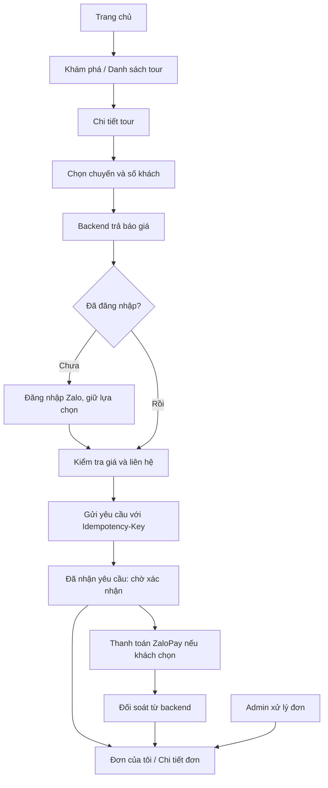

# Kế hoạch giao diện VNA Đắk Song theo Stitch

Đối chiếu ngày 08/10/2026 với thư mục `stitch_vna_k_song_booking_tour`, frontend và routes/models backend trong workspace. Đây là kế hoạch triển khai; chưa thay đổi code giao diện trong bước này.

## 1. Phạm vi và hiện trạng

Làm hai giao diện dùng chung backend: **Mini App cho khách** và **web quản trị cho admin**. Giữ bố cục, màu, thẻ nội dung, lịch trình, form và bảng quản trị từ Stitch; điều chỉnh nội dung và thao tác theo dữ liệu API thực tế.

Thư mục Stitch có **19 file code.html**: 13 mẫu mobile, trong đó hai bản danh sách đơn của khách gần trùng nhau, và 6 mẫu quản trị desktop. Ngoài ra có `dak_song_highland_journeys/DESIGN.md`, logo VNA và một ảnh cắt phần phương thức thanh toán. Không tính 19 mẫu này là 19 chức năng độc lập đã có API.

Frontend hiện có React 18, TypeScript, Router 6, ZaUI, ZMP SDK, Axios và Vite. `HomePage`, `LoginPage`, Khám phá, Tour và Đơn của tôi mới là khung/placeholder; chưa có luồng booking. `AuthContext` mới giữ state, chưa quản lý phiên API đầy đủ; hàm login hiện đang gán trực tiếp setUser nên chưa xử lý đúng hai đối số token/user. Chưa có API client, các trang chi tiết hoặc giao diện admin.

## 2. Thiết kế sẽ áp dụng

Ưu tiên hình ảnh trong `screen.png` và token trong `code.html`. `DESIGN.md` có hai nhóm màu khác nhau giữa phần khai báo và mô tả; sẽ thống nhất theo nhóm đang được các màn HTML sử dụng:

| Thành phần | Quy ước |
| --- | --- |
| Màu chính | `#04432F`; biến thể `#245B45` |
| Nền | `#F3FCF5`; card trắng; nền phụ `#EDF6EF` |
| Điểm nhấn/giá | `#914B2B` |
| Chữ chính/phụ | `#151D19` / `#404944` |
| Font | Inter nếu có asset phù hợp; fallback font hệ thống đọc tốt tiếng Việt |
| Khoảng cách | Lề 16px; khoảng section 24px; card 12–16px |
| Bo góc | Card/nút 12–16px; chip bo tròn; sheet bo góc trên |
| Tương tác | Nút chính khoảng 48px; có trạng thái đang gửi, disabled và lỗi |
| Ảnh | Hero rộng, card điểm đến dạng ảnh dọc, card tour có ảnh và giá như Stitch |

Giữ đặc trưng từng nhóm: trang chủ có hero và tour dạng hàng ngang; danh sách tour có bộ lọc; chi tiết có lịch trình; checkout có thanh tổng tiền cố định. Admin dùng sidebar xanh đậm, header gọn, bảng, bộ lọc và drawer chi tiết.

Sửa các lỗi hiển thị đang thấy trong ảnh mẫu: logo bị hỏng, tiêu đề tiếng Anh bị cắt, nhãn/giá xuống dòng bất hợp lý. Dùng logo local đã có trong `frontend/src/assets/images/0bbfd724.png`, giữ đúng tỷ lệ. Không cắt cả screenshot làm giao diện.

HTML Stitch hiện dùng Tailwind CDN và dữ liệu tĩnh. Chuyển bố cục sang component React, CSS và ZaUI trong project; không bê nguyên script CDN hoặc HTML nguyên khối vào app. Các ảnh ngoài là nguồn tham chiếu thiết kế; ảnh sản phẩm chính lấy từ API, có alt/credit và nguồn phù hợp. Chưa có dữ liệu thì hiển thị trạng thái trống, không dùng tour/giá mẫu để che lỗi API.

Mini App giữ bốn tab **Trang chủ · Khám phá · Tour · Đơn hàng**. Tài khoản mở từ avatar. Trang chi tiết và checkout ẩn bottom navigation. Header trong Zalo và header xem thử trên browser được xử lý riêng để không trùng nút back hoặc thanh hệ thống Zalo.

## 3. Danh mục màn hình và nguồn Stitch

Tên route dưới đây là dự kiến cho frontend, không phải thêm endpoint backend.

### Mini App của khách

| Màn hình | Nguồn trong stitch_vna_k_song_booking_tour | Route dự kiến | Chức năng |
| --- | --- | --- | --- |
| Trang chủ | `trang_ch_vna_k_song` | `/` | Hero, điểm đến, tour gợi ý; dẫn sang Khám phá/Tour |
| Khám phá | `kh_m_ph_vna_k_song` | `/explore` | Điểm đến và cẩm nang; lọc theo category API |
| Danh sách tour | `danh_s_ch_tour_vna_k_song` | `/tours` | Tìm kiếm, chủ đề, ngày, giá, thời lượng, sắp xếp, phân trang |
| Chi tiết tour | `chi_ti_t_tour_vna_k_song` | `/tours/:id` | Ảnh, tổng quan, lịch trình, điểm hẹn, dịch vụ, chính sách, lưu tour |
| Chọn chuyến | `t_tour_ch_n_chuy_n` | `/booking/:tourId/select` | Ngày/giờ đang nhận yêu cầu, người lớn/trẻ em, lấy quote |
| Kiểm tra và gửi yêu cầu | `t_tour_x_c_nh_n_th_ng_tin` | `/booking/:tourId/review` | Liên hệ, ghi chú, coupon, bảng giá từ quote, paymentMethod |
| Gửi yêu cầu thành công | `t_tour_th_nh_c_ng_vna_k_song` | `/booking/success/:bookingId` | Mã đơn, snapshot và trạng thái chờ xác nhận |
| Đơn của tôi | `qu_n_l_n_h_ng_vna_k_song` + `_1` | `/my-bookings` | Gộp hai mẫu thành một màn; lọc đúng các trạng thái booking |
| Chi tiết đơn | `chi_ti_t_n_h_ng_vna_k_song` | `/my-bookings/:id` | Snapshot, lịch sử, trạng thái tiền riêng, hủy có lý do, đối soát thanh toán |
| Đăng nhập Zalo | `ng_nh_p_zalo_vna_k_song` | `/login` | Đăng nhập khi đặt/lưu/xem đơn; khách vẫn khám phá được khi chưa đăng nhập |
| Giải thích quyền | `c_p_quy_n_zalo_vna_k_song` | Luồng auth/checkout | Giải thích quyền cần dùng, gọi SDK thật; không vẽ hộp cấp quyền hệ thống giả |
| Tài khoản | `t_i_kho_n_vna_k_song` | `/account` | Hồ sơ, điểm/hạng, đơn của tôi, tour đã lưu, đăng xuất |

Các màn cần thiết kế bổ sung từ cùng bộ component: **chi tiết điểm đến**, **chi tiết bài viết**, **tour đã lưu**, sheet nhập lý do hủy, trạng thái thanh toán đang xử lý/thất bại, 404 và yêu cầu đăng nhập. Stitch chưa có đủ các màn này.

### Web quản trị

| Màn hình | Nguồn Stitch | Route dự kiến | Phạm vi bản dùng được với API hiện tại |
| --- | --- | --- | --- |
| Tổng quan | `t_ng_quan_qu_n_tr_vna_k_song` | `/admin` | Số đơn theo trạng thái, tour/điểm đến/chuyến đang mở, tổng giá trị đơn |
| Quản lý đơn | `qu_n_l_n_h_ng_vna_k_song_2` | `/admin/bookings` | Danh sách, lọc mã/trạng thái/chuyến, chi tiết, xác nhận/từ chối/hủy/hoàn thành, đối soát và refund ZaloPay |
| Quản lý tour | `qu_n_l_tour_vna_k_song` | `/admin/tours` | Tạo/sửa/xem/lưu trữ; form lịch trình, điểm đến, ảnh và chính sách |
| Quản lý chuyến | `qu_n_l_chuy_n_i_kh_i_h_nh_vna_k_song` | `/admin/departures` | Ngày/giờ, deadline, giá người lớn/trẻ em, giới hạn khách mỗi đơn, mở/đóng |
| Coupon | `khuy_n_m_i_coupon_vna_k_song` | `/admin/coupons` | Tạo/sửa/xóa, bật/tắt từng mã, loại giảm, điều kiện, ngày hiệu lực, quota |
| Khách hàng/hội viên | `qu_n_l_kh_ch_h_ng_h_i_vi_n_vna_k_song` | `/admin/customers` | Chưa có API quản trị người dùng; nằm trong phần cần bổ sung backend |

Admin còn thiếu thiết kế: **đăng nhập**, **CRUD điểm đến**, **CRUD bài viết**, các form/sheet xác nhận thao tác và lỗi. Dựng theo sidebar/bảng/drawer của các màn admin sẵn có. Không bỏ CRUD điểm đến/bài viết chỉ vì Stitch chưa có screenshot riêng.

## 4. Các chi tiết Stitch cần điều chỉnh theo backend

| Chi tiết trong mẫu | Backend hiện tại | Cách làm trong bản đầu |
| --- | --- | --- |
| “Còn 4 chỗ”, phần trăm lấp đầy, tổng quota chuyến | Chỉ có maxGuestsPerBooking, chưa có tổng sức chứa/remainingSeats | Hiện “Đang nhận yêu cầu”, hạn đặt và giới hạn mỗi đơn; không coi giới hạn mỗi đơn là sức chứa chuyến |
| Giữ chỗ/xác nhận ngay sau khi gửi | Booking mới pending_confirmation | Nút “Gửi yêu cầu đặt tour”; trang thành công ghi “Đã nhận yêu cầu, chờ VNA xác nhận” |
| VietQR tự xác nhận, đặt cọc 30% | Có enum qr_transfer nhưng chưa có luồng VietQR/xác nhận cọc; ZaloPay thu toàn bộ total | Bản đầu ưu tiên cash_on_arrival và zalopay; không hiển thị QR/deposit như tính năng đã hoạt động |
| Nút admin “Xác nhận đã hoàn tiền” | Refund ZaloPay cần gửi yêu cầu rồi query xác nhận | Đổi thành “Gửi yêu cầu hoàn tiền” / “Kiểm tra hoàn tiền”; không gán refunded bằng nút thủ công |
| Người lớn, trẻ em, em bé và giá trẻ em mặc định 50% | Chỉ adults/children; giá theo Departure và childPolicy | Dùng hai bộ đếm; không thêm infants hoặc áp tỷ lệ/độ tuổi chung từ mẫu |
| Email liên hệ, CCCD, ngày sinh, danh sách từng hành khách | Booking chỉ có contact.name, contact.phone, note và số lượng | Form nhập đúng trường đang lưu; không thu thông tin không được backend xử lý |
| Điểm đón riêng, phương tiện, HDV, biển số, điểm danh | Chưa có các cấu trúc/phân công này | Hiển thị meetingPoint/snapshot; không tạo dropdown hoặc danh sách phân công giả |
| Sao, số review, bản đồ, thời tiết, khoảng cách | Chưa có API/field tương ứng cho các phần này | Không hiển thị số đánh giá, dữ liệu thời tiết/khoảng cách hay map marker tự bịa |
| Lưu điểm đến, kho ảnh chuyến, ví, vé QR/check-in | Chỉ lưu tour; chưa có API cho các mục còn lại | Triển khai savedTours; các mục khác vào backlog, không để nút giả hoạt động |
| Hạng Vàng từ 500 điểm, ưu đãi 10% tự động | Logic cộng hạng hiện dùng 1.000 điểm Vàng, 5.000 Kim Cương; giảm giá qua coupon | Hiện loyaltyPoints/membershipTier thực; thanh tiến trình đúng ngưỡng, không tự giảm giá theo hạng |
| Số điện thoại “Zalo Verified” trong hồ sơ | User chưa có phone hoặc cờ xác thực điện thoại | Nhập contact.phone; không suy ra xác thực điện thoại từ việc đăng nhập Zalo |
| Super Admin, kế toán, HDV | Chỉ role user/admin | Giao diện phân quyền đúng hai role; không gán thêm quyền từ nhãn Stitch |
| Dashboard doanh thu tháng, tăng trưởng, mục tiêu và realtime | API dashboard trả tổng giá trị confirmed/completed, không phải tiền thu thực tế hoặc chuỗi thời gian | Ghi “Tổng giá trị đơn xác nhận/hoàn thành”; bỏ số tăng trưởng/biểu đồ theo tháng chưa có dữ liệu |
| Tìm admin theo khách, lọc paymentStatus/khoảng ngày | GET bookings hiện hỗ trợ code/status/departureId/page/limit | Chỉ đưa bộ lọc được API hỗ trợ vào bản đầu; không lọc một trang rồi gọi đó là kết quả toàn hệ thống |
| Cảnh báo tổng số đơn cần refund, badge thông báo | Chưa có tổng hợp paymentStatus hoặc notification API | Hiển thị trạng thái từng đơn thực; tổng toàn hệ thống cần API tổng hợp |
| Coupon dành riêng tour/thành viên, tặng mã cá nhân | Coupon đang là mã chung, chưa có phạm vi khách/tour | Dùng các điều kiện hiện có; không gán scope/tặng cá nhân từ frontend |
| Hứa liên hệ trong 15 phút, hotline mẫu, hoạt động 24/7 | Chưa có cấu hình nghiệp vụ xác nhận các nội dung đó | Dùng thông tin VNA cung cấp; thông báo “VNA sẽ liên hệ xác nhận”, không giữ số điện thoại và SLA mẫu |
| ZNS/SMS, xuất/nhập Excel, duyệt hàng loạt, tạo đơn thủ công | Chưa có luồng riêng đầy đủ cho các thao tác này | Đưa vào backlog; làm từng thao tác hiện có trước, không gửi hàng loạt từ nút mẫu |

Tự hủy đơn: code hiện cho khách hủy cả pending_confirmation và confirmed, có lý do. UI bám quy tắc đang chạy này; không áp dụng giới hạn “chỉ pending” từ tài liệu đề xuất cũ. Chính sách hủy vẫn hiển thị từ snapshot, chưa tự tính phí/hoàn một phần.

## 5. Luồng chính cần hoàn thành



1. Khách được đọc nội dung và chọn chuyến trước khi đăng nhập. Đăng nhập khi cần gửi đơn, lưu tour hoặc xem dữ liệu cá nhân; quay lại đúng màn và giữ draft.
2. Quote là nguồn giá chính: subtotal, discountAmount, total, coupon áp dụng, quoteToken và expiresAt. Đổi chuyến/số khách/coupon thì lấy lại quote; xử lý response cũ đến muộn để không ghi đè lựa chọn mới.
3. Bước chọn chuyến và bước kiểm tra dùng chung BookingDraftContext, không giữ hai bản state độc lập. Draft lưu lựa chọn; không coi tổng tiền trong draft là giá đã được server chấp nhận.
4. Khi gửi, khóa nút, dùng một Idempotency-Key cho đúng payload. Timeout chưa rõ có tạo được đơn hay chưa thì retry nguyên payload/key; không tự lấy quote mới hoặc đổi key trước khi giải quyết lần gửi đang treo. Khi có 409 xác định quote đổi/hết hạn, cho khách xem lại giá rồi tạo lần gửi mới.
5. Chỉ mở trang đã nhận yêu cầu sau response tạo/replay đơn thành công. Lịch sử đơn đọc snapshot, không thay tên/giá lịch sử bằng tour hiện tại.
6. Với ZaloPay, tạo booking trước, sau đó tạo giao dịch theo bookingId. Khi provider trả về hoặc app mở lại, query backend rồi đọc lại booking. URL redirect không phải bằng chứng đã thanh toán.
7. Giữ route `/booking/success/:bookingId` khớp redirect hiện tại của backend. Khi triển khai kiểm tra cách ánh xạ URL browser vào ZMPRouter và cách quay lại Mini App trên Zalo thật; không giả định redirect web tự khôi phục navigation trong Mini App.
8. Trạng thái đơn và trạng thái tiền hiển thị thành hai badge riêng. Paid không có nghĩa confirmed; cancelled có thể vẫn refund_pending.
9. Hủy/từ chối cần lý do. Admin chỉ thấy hành động chuyển trạng thái hợp lệ; completed trước giờ kết thúc phải xử lý 409 của server.
10. Refund: admin lấy appTransId từ payments trong chi tiết booking, gửi yêu cầu, hiển thị đang chờ, query đến khi provider xác nhận. Timeout giữ mã yêu cầu cũ và ưu tiên đối soát.

## 6. Kết nối API và tổ chức frontend

### API đã có để nối giao diện

| Chức năng | Endpoint chính |
| --- | --- |
| Điểm đến | GET /api/destinations; GET /api/destinations/:id |
| Bài viết | GET /api/articles; GET /api/articles/:id |
| Tour / chuyến công khai | GET /api/tours; GET /api/tours/:id; GET /api/tours/:id/departures |
| Tour đã lưu | GET /api/tours/saved; POST /api/tours/:id/save — đây là toggle, không tự retry vô điều kiện |
| Auth khách/admin | POST /api/auth/zalo; POST /api/auth/admin/login; GET /api/auth/me |
| Báo giá / tạo đơn | POST /api/bookings/quote; POST /api/bookings với Idempotency-Key |
| Đơn của khách | GET /api/bookings/mine; GET /api/bookings/:id; PATCH /api/bookings/:id/cancel |
| Admin đơn/dashboard | GET /api/bookings; PATCH /api/bookings/:id/status; GET /api/bookings/dashboard-data |
| Thanh toán | POST /api/payments/zalopay/create; POST /api/payments/zalopay/:appTransId/query |
| Admin hoàn tiền | POST /api/payments/zalopay/:appTransId/refund; POST /api/payments/zalopay/:appTransId/refund/query |
| Admin nội dung/tour/chuyến | GET/POST và PUT/PATCH/DELETE theo các route /api/destinations, /api/articles, /api/tours, /api/departures hiện có |
| Admin coupon | GET/POST /api/coupons; PUT/DELETE /api/coupons/:id |
| Admin upload | POST /api/upload, multipart field image; không tự đặt Content-Type JSON |

Webhook thanh toán dành cho provider, frontend không tự ký/gửi callback để đánh dấu paid. `GET /api/auth/me` trả `{ user }`; nhiều danh sách trả `{ data, pagination }`; một số API chi tiết nội dung trả document trực tiếp. Type/API helper phải theo response thực tế, không ép mọi API thành một kiểu envelope.

### Cấu trúc dự kiến

Giữ stack đang cài và cách viết hàm rõ ràng theo project. Mỗi page có handler async/try-catch và state loading/error; tách component/hook khi có phần dùng chung thực tế. Không tạo hệ thống form/config tổng quát hoặc thêm thư viện state chỉ để dựng các màn này.

```text
frontend/
  src/
    pages/
      HomePage.tsx
      ExplorePage.tsx
      tours/          # Danh sách, chi tiết, tour đã lưu
      destinations/   # Chi tiết điểm đến
      articles/       # Chi tiết bài viết
      booking/        # Chọn chuyến, kiểm tra, thành công, chi tiết, danh sách
      auth/           # Đăng nhập Zalo, giải thích quyền
      account/        # Hồ sơ
    components/
      layout/         # Header, bottom navigation, page shell
      tour/           # TourCard, Gallery, Itinerary
      booking/        # DeparturePicker, GuestCounter, PriceBreakdown, status badges
      common/         # Loading, EmptyState, ErrorState, dialog xác nhận
    context/
      AuthContext.tsx
      BookingDraftContext.tsx
    hooks/            # Chỉ các logic fetch/state dùng lại
    utils/
      axiosInstance.ts
      apiPaths.ts
      zalo.ts         # Adapter SDK/storage, tách môi trường browser và Zalo
      format.ts       # Tiền, ngày giờ, thời lượng
    types/            # Kiểu API thực tế: User, Tour, Departure, Booking...
    styles/           # Token và thành phần dùng chung
    admin/
      main.tsx
      App.tsx
      pages/          # Dashboard, Booking, Tour, Departure, Destination, Article, Coupon
      components/     # Sidebar, Table, Drawer, ImageUploader, SourceEditor...
  admin.html
  vite.config.ts
  vite.admin.config.ts
```

Mini App và admin dùng hai entry và **hai build riêng**. Mini App giữ ZMPRouter/ZaUI; admin dùng router web, layout desktop và form React, không bọc ZMP App. Chỉ chia sẻ token CSS, kiểu dữ liệu và tiện ích không phụ thuộc SDK.

Cần lưu ý plugin `miniAppManifest` trong vite.config.ts hiện gom toàn bộ entry JS/CSS. Không chỉ thêm admin.html vào cùng build rồi để plugin đưa bundle admin vào app-config.json. Build admin không chạy plugin manifest Mini App và có thư mục output riêng.

AuthContext phải có User type, token, loading, login(token, user), logout và kiểm tra phiên bằng /auth/me. Route admin kiểm tra role từ server; phiên khách/admin có nơi lưu phù hợp và tách nhau. Mock login chỉ phục vụ môi trường dev được backend cho phép, không thay đăng nhập Zalo thật khi bàn giao.

Giá hiển thị bằng định dạng VND; ngày giờ theo Việt Nam, gửi ISO có múi giờ rõ ràng. Form admin đặt giá ở **Departure**, không thêm adultPrice/childPrice vào Tour. Tour lưu durationHours, itinerary, includes/excludes và chính sách theo model. Điểm đến/bài viết published cần nguồn; form phải có sources và images đúng cấu trúc. Bản đầu đọc nội dung dạng text/đoạn văn; nếu thêm editor HTML thì phải có bước xử lý nội dung an toàn trước khi render.

DELETE tour/điểm đến/bài viết là lưu trữ; DELETE departure là đóng nhận yêu cầu; DELETE coupon là xóa document. Nhãn và dialog phải phản ánh đúng hành vi, không dùng chung một lời “xóa vĩnh viễn”.

## 7. Thứ tự triển khai và đầu ra

| Chặng | Công việc | Điều kiện hoàn thành |
| --- | --- | --- |
| 1 — Nền giao diện | Token, logo/ảnh, layout khách/admin, navigation, bộ state UI; dựng Trang chủ, Chi tiết tour và Kiểm tra yêu cầu làm ba màn đại diện | Đối chiếu trực quan với Stitch ở kích thước điện thoại và admin desktop; chưa cần dựng toàn bộ màn cùng lúc |
| 2 — Khám phá và auth | Nối điểm đến/bài viết/tour, bộ lọc API, chi tiết, Zalo login, phiên, tài khoản, savedTours | Khách chưa đăng nhập vẫn khám phá; đăng nhập và quay lại đúng màn; dữ liệu đọc từ API |
| 3 — Booking và tiền | Chọn chuyến, quote/coupon, liên hệ, idempotency, gửi thành công, đơn của tôi, hủy, ZaloPay create/query | Luồng khách chạy hết với backend; không tạo trùng khi retry; giá đổi phải xem lại; tiền/đơn tách trạng thái |
| 4 — Admin dùng được | Đăng nhập, dashboard đúng số liệu, CRUD điểm đến/bài viết/tour/chuyến/coupon, upload ảnh, đơn hàng, lịch sử, xác nhận/từ chối/hủy/hoàn thành/refund | Admin tạo nội dung/chuyến để khách thấy; xử lý đơn để khách đọc được trạng thái mới; đầy đủ CRUD có API |
| 5 — Hoàn thiện và kiểm tra | Responsive, safe area, bàn phím, loading/lỗi/rỗng, accessibility, build Mini App/admin tách nhau; thử Zalo và thanh toán sandbox thật | Build/typecheck đạt; luồng người dùng và admin đạt tiêu chí bên dưới; ghi rõ phần đã thử trên thiết bị thật |

Khách hàng/hội viên, ZNS, sức chứa chuyến, thống kê mở rộng và những tính năng thiếu API ở mục 4 nằm trong backlog riêng. Để giữ đủ thiết kế đó, cần lập hạng mục backend tương ứng trước khi nối thành chức năng thật; không thay bằng dữ liệu mẫu trong bản bàn giao.

## 8. Trạng thái và tiêu chí nghiệm thu

| Nhóm | Các tình huống phải kiểm tra |
| --- | --- |
| Hiển thị | Mobile 360/390/430px; admin 1280/1440px; cửa sổ hẹp có sidebar thu gọn và vùng bảng cuộn riêng; không tràn toàn trang |
| Stitch | Đúng thứ tự section, tỷ lệ ảnh, màu chủ đạo, loại card, khoảng cách; logo không hỏng; tiêu đề tiếng Việt đủ dấu và không bị cắt như mẫu |
| Navigation | Back giữ lựa chọn, tab đúng trạng thái, login quay lại màn trước, checkout không bị bottom navigation/safe area che nút |
| Dữ liệu | Loading, không có tour/chuyến/đơn, lỗi mạng, ảnh lỗi; không âm thầm chuyển sang dữ liệu giả |
| Quote | Đổi chuyến/số khách/coupon, quote hết hạn, coupon sai, giá/deadline thay đổi, response cũ tới muộn |
| Gửi đơn | Bấm nhanh hai lần, timeout, replay cùng key, xung đột key/payload; chỉ báo thành công khi server đã lưu |
| Trạng thái | Pending/confirmed/completed/cancelled/rejected và unpaid/paid/refund_pending/refunded hiển thị riêng |
| Thanh toán | Provider redirect/query đang xử lý, create timeout, callback chậm, đã paid nhưng chưa confirmed; không tự gán paid từ URL |
| Admin | Validate form, 400/401/403/409/413, nguồn khi published, đóng chuyến đã có đơn, cập nhật status hợp lệ, không completed trước giờ kết thúc |
| Refund | Gửi yêu cầu chưa phải refunded; timeout không gửi lệnh mới; query rồi đọc lại booking; nút disabled khi đang xử lý |
| Phiên | Không token, hết hạn, logout, đổi tài khoản, khách truy cập admin bị chặn; quyền thực tế do backend kiểm tra |
| Quyền Zalo | Từ chối quyền vẫn nhập liên hệ được; phân biệt giải thích trong app với hộp quyền thật; thử luồng trên Zalo thật |
| Build | npm.cmd run typecheck; build Mini App và build admin riêng; manifest không chứa entry quản trị |

Luồng demo kết thúc phải có đủ: **admin tạo điểm đến/tour/chuyến → khách chọn và gửi yêu cầu → admin nhìn thấy đơn và xác nhận → khách thấy confirmed → thanh toán/đối soát đúng trạng thái nếu có → hủy/hoàn tiền đúng điều kiện**.

Không cần viết lại test backend cho thay đổi thuần giao diện. Khi triển khai, ưu tiên test luồng có rủi ro như quote, retry tạo đơn, auth và thanh toán; kết quả build/browser không thay cho kiểm thử SDK trên Zalo thật.
