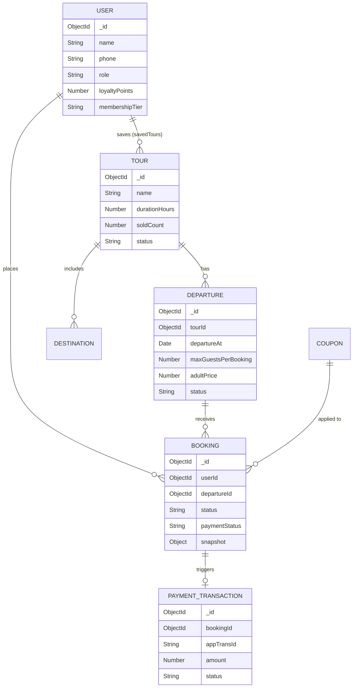
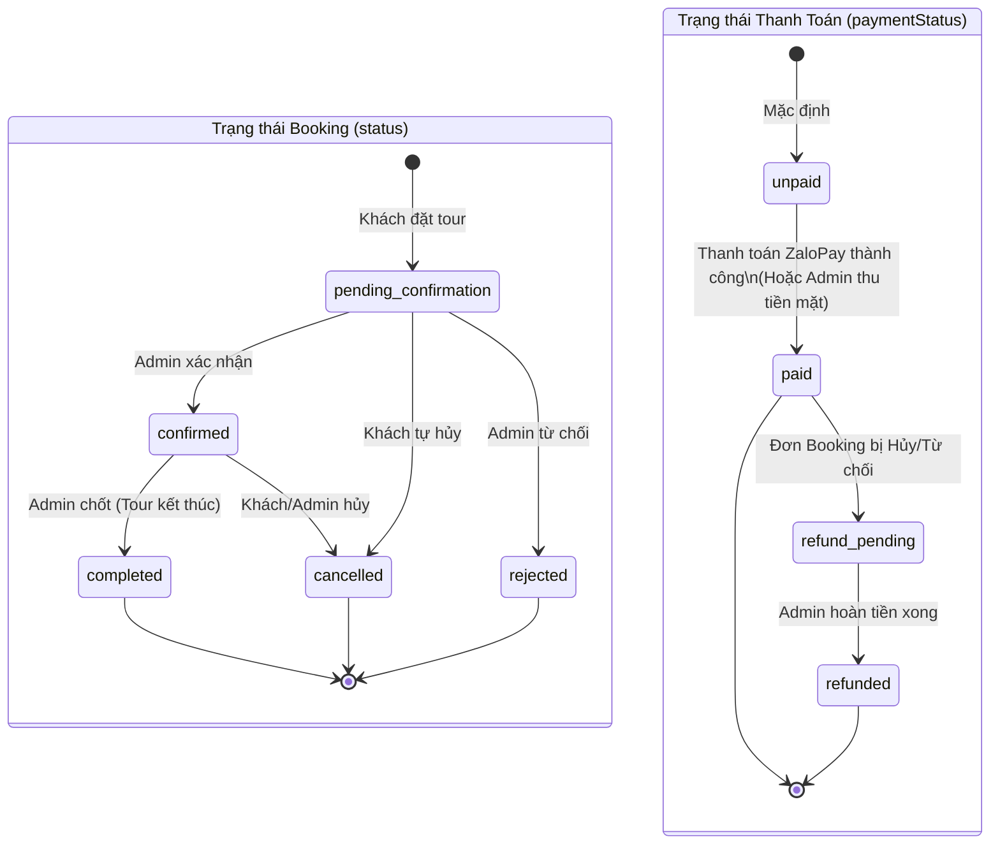
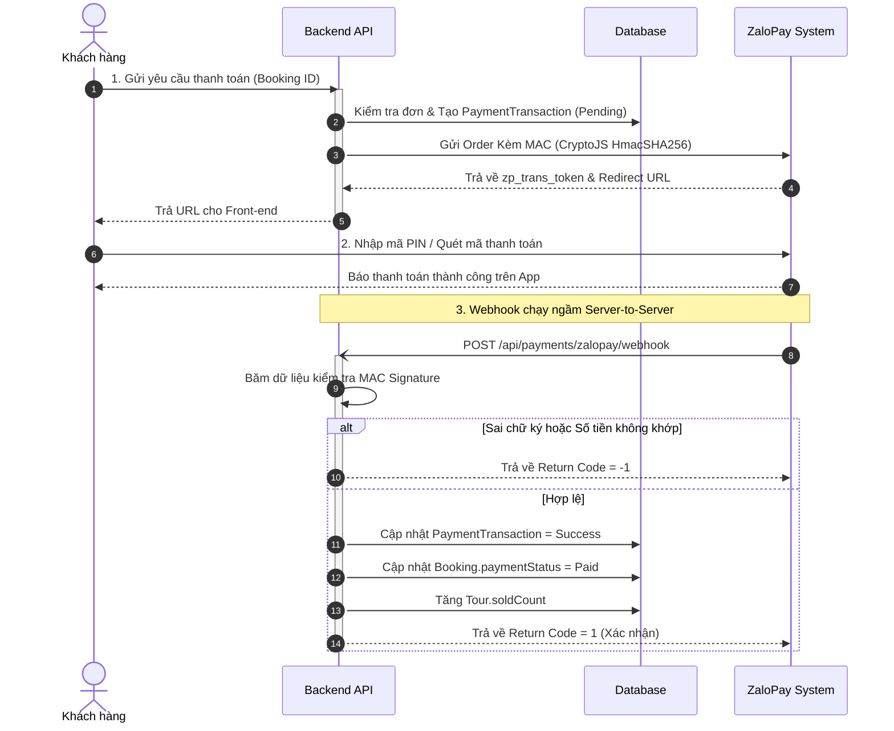
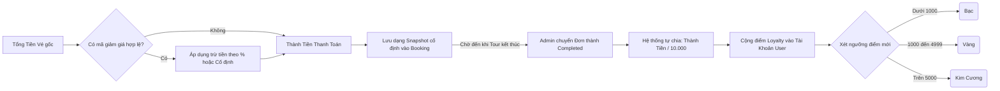

# Tài Liệu Tổng Quan Hệ Thống Backend - VNA Đắk Song Booking Tour

Tài liệu này tổng hợp toàn bộ kiến trúc, mô hình dữ liệu, phân quyền (Roles), danh sách API chi tiết theo từng chức năng và các quy trình nghiệp vụ (Business Logic) quan trọng của hệ thống backend. Hệ thống được thiết kế nhắm tới thị trường Việt Nam (tất cả thông báo lỗi bằng tiếng Việt) và đảm bảo các tiêu chuẩn bảo mật, đồng bộ dữ liệu.

---

## 1. Công Nghệ Sử Dụng (Tech Stack)
- **Runtime**: Node.js
- **Framework**: Express.js
- **Database**: MongoDB (sử dụng Mongoose)
- **Authentication**: JSON Web Token (JWT) cho phiên đăng nhập và báo giá (Quote Token).
- **Payment Gateway**: ZaloPay (Tích hợp Server-to-Server qua Webhook)
- **Utilities**: `bcryptjs` (băm mật khẩu), `crypto-js` (tạo chữ ký ZaloPay), `moment` (xử lý ngày tháng).

---

## 2. Phân Quyền (Roles) và Chi Tiết Chức Năng Từng Phân Hệ

Hệ thống được chia thành 3 nhóm người dùng, quản lý quyền truy cập qua các Middleware (`protect`, `optionalProtect`, `adminOnly`). Dưới đây là liệt kê **chi tiết từng chức năng cụ thể** của từng nhóm:

### 2.1. Guest (Khách vãng lai / Người dùng chưa đăng nhập)
Khách hàng mở Zalo Mini App nhưng chưa cấp quyền cho Zalo ID, hoặc chưa đăng nhập.
- **Quản lý Tài khoản**: Không có.
- **Quản lý Tour**:
  - Xem danh sách Tour đang mở bán (Trạng thái `published`).
  - Lọc Tour theo giá (từ/đến), chủ đề (nature, culture, food...), điểm đến.
  - Sắp xếp Tour theo: Mới nhất, giá tăng/giảm, thời lượng, được mua nhiều nhất.
  - Xem chi tiết lịch trình, hình ảnh, điểm đón, chính sách của 1 Tour cụ thể.
- **Quản lý Điểm khởi hành (Departure)**:
  - Xem các chuyến đi đang mở (`open`), chưa qua hạn đặt chỗ (`bookingDeadline`) của một Tour cụ thể. Giá người lớn, trẻ em.
- **Điểm đến (Destination) & Bài viết (Article)**:
  - Xem toàn bộ danh sách và chi tiết các Điểm đến và Bài viết công khai (Cẩm nang du lịch).

### 2.2. Customer (Khách hàng đã đăng nhập)
Khách hàng cấp quyền trên Zalo Mini App, hệ thống sẽ cấp JWT Token. Nhóm này **kế thừa toàn bộ quyền của Guest**, cộng thêm các quyền:
- **Quản lý Tài khoản cá nhân**:
  - Xem hồ sơ (Tên, Số điện thoại, Email nếu có).
  - Kiểm tra Hạng thành viên (Bạc, Vàng, Kim Cương) và Điểm thưởng (Loyalty Points) hiện tại.
- **Quản lý Tour yêu thích (Saved Tours)**:
  - Xem danh sách toàn bộ các Tour đã lưu (chỉ hiển thị những tour còn đang `published`).
  - Thêm một Tour vào danh sách yêu thích hoặc bỏ lưu (Toggle chức năng).
- **Quản lý Báo giá (Quote) & Khuyến Mãi (Coupon)**:
  - Gửi yêu cầu kiểm tra giá cho 1 chuyến đi (số người lớn, trẻ em).
  - Tự động kiểm tra tính hợp lệ, thời hạn, giới hạn số lần dùng của Mã giảm giá (Coupon).
  - Nhận về Token báo giá (thời hạn mặc định 10 phút) có khóa giá trị thanh toán cố định.
- **Quản lý Đặt chỗ (Booking)**:
  - Đặt tour chính thức (sử dụng Quote Token và Idempotency Key để chống đặt trùng 2 lần).
  - Xem danh sách toàn bộ lịch sử các chuyến đã đặt, lọc theo trạng thái (chờ xác nhận, đã xác nhận, hoàn thành, hủy).
  - Hủy các đơn đặt tour **khi chưa xác nhận hoặc chưa trả tiền**. (Nếu đơn đã confirmed hoặc đã trả tiền, phải liên hệ admin để hủy).
- **Thanh toán (Payment)**:
  - Bấm thanh toán online qua ZaloPay cho các đơn đang chờ xác nhận hoặc đã xác nhận (nhưng chưa thanh toán).

### 2.3. Admin (Quản trị viên)
Nhân viên/Quản lý VNA truy cập qua hệ thống Web Dashboard. Admin **có toàn quyền** với dữ liệu.
- **Bảng điều khiển (Dashboard)**:
  - Xem thống kê số lượng Booking theo từng trạng thái.
  - Thống kê tổng số Tour, Điểm đến, Chuyến đi đang mở.
  - Thống kê **Tổng Doanh Thu (Total Revenue)** dựa trên các đơn đã xác nhận và hoàn thành.
- **Quản lý Tour**:
  - Tạo mới, sửa thông tin chi tiết (Lịch trình đa cấp, chủ đề, hình ảnh).
  - Xóa mềm (Lưu trữ/Archive) Tour.
- **Quản lý Chuyến khởi hành (Departure)**:
  - Thêm, sửa, xóa các chuyến khởi hành, cấu hình số khách tối đa cho mỗi yêu cầu (`maxGuestsPerBooking`).
- **Quản lý Booking**:
  - Xem toàn bộ đơn đặt chỗ của tất cả khách hàng.
  - Duyệt/Xác nhận đơn (`confirmed`), Từ chối đơn (`rejected`) với lý do đi kèm.
  - Hoàn thành đơn (`completed`) - Hành động này kích hoạt cộng điểm thưởng cho khách hàng.
- **Quản lý Thanh toán**:
  - Theo dõi trạng thái thanh toán. Hệ thống tự động chuyển đơn sang trạng thái Cần Hoàn Tiền (`refund_pending`) nếu khách thanh toán thành công nhưng đơn đó trước đó đã bị Admin từ chối/hủy.
- **Quản lý Khuyến mãi (Coupon)**:
  - Tạo mã giảm giá (Cố định/Phần trăm). Cấu hình giới hạn sử dụng tối đa, giá trị đơn hàng tối thiểu, mức giảm tối đa.
- **Quản lý Nội dung (CMS)**:
  - Tạo, Sửa, Xóa Bài viết (Article) và Điểm đến (Destination). Đảm bảo mọi nội dung đều cần nguồn (sources) nếu ở trạng thái xuất bản (`published`).
  - Upload hình ảnh.

---

## 3. Mô Hình Dữ Liệu (Models & ERD)

Sơ đồ quan hệ thực thể (ERD) dưới đây thể hiện sự liên kết giữa các bảng chính trong hệ thống:



- **User**: Lưu thông tin, điểm thưởng, và lịch sử tour yêu thích.
- **Tour**: Lưu thông tin gốc (có đánh chỉ mục văn bản `text index` để tìm kiếm).
- **Departure**: Chuyến đi cụ thể, quản lý ngày xuất phát và giá vé.
- **Booking**: Lưu "snapshot" thông tin giá cả, ngăn ngừa thay đổi giá sau khi đặt. Trạng thái tour (`status`) tách biệt với trạng thái thanh toán (`paymentStatus`).
- **PaymentTransaction**: Theo dõi từng giao dịch gửi sang ZaloPay.
- **Coupon**: Mã giảm giá, hỗ trợ giảm theo % hoặc số tiền cố định.

---

## 4. Các Quy Trình Nghiệp Vụ Cốt Lõi (Core Business Logic)

### 4.1. Vòng Đời Của Một Đơn Đặt Tour (Booking Lifecycle)

Một Đơn hàng (Booking) có hai trạng thái chạy song song: **Trạng thái Đơn (`status`)** và **Trạng thái Thanh toán (`paymentStatus`)**. Việc tách biệt này giúp Admin phân biệt được khách "đã trả tiền nhưng tour bị hủy" hoặc "tour đã xác nhận nhưng chờ khách trả tiền mặt".



### 4.2. Luồng Thanh Toán ZaloPay (Webhook Security)

Hệ thống thanh toán hoạt động bất đồng bộ (Asynchronous) và bảo mật tuyệt đối. Dù mạng của khách rớt giữa chừng, ZaloPay vẫn gọi Webhook ngầm cho Backend.



### 4.3. Cơ chế Chống Đặt Trùng (Idempotency) & Cạnh Tranh (Concurrency)

Giải quyết việc người dùng ấn nút "Gửi" nhiều lần hoặc hai nhân viên cùng chỉnh sửa/đặt một đơn vé cuối cùng.

```mermaid
flowchart TD
    Start([Khách chọn 2 vé và ấn Submit]) --> A[Gắn Header Idempotency-Key]
    A --> B{Kiểm tra Database: Key này có chưa?}
    
    B -- Có -->> C{Khớp toàn bộ dữ liệu (Hash)?}
    C -- Giống hệt -->> D[Bỏ qua, trả về đơn hàng cũ]
    C -- Khác nhau -->> E[Báo lỗi: Key đã dùng cho đơn khác]
    
    B -- Chưa có -->> F[Bắt đầu Mongoose Session Transaction]
    F --> G[Truy vấn số ghế trống của Chuyến đi]
    
    G --> H{Số chỗ yêu cầu <= Chỗ trống?}
    H -- Sai -->> I[Rollback Transaction: Báo lỗi hết chỗ]
    
    H -- Đúng -->> J[Cập nhật Departure version (__v)]
    J --> K{Có bị xung đột Version do người khác không?}
    K -- Có xung đột -->> I
    
    K -- Không xung đột -->> L[Ghi dữ liệu Booking, lưu Snapshot Giá]
    L --> M[Commit Transaction]
    M --> N([Trả về kết quả Thành công])
```

### 4.4. Hệ Thống Điểm Thưởng & Khuyến Mãi (Coupons & Loyalty)

Cơ chế Snapshot giữ giá cố định và cách cộng điểm/thăng hạng tự động hoạt động như sau:



---

## 5. Danh Sách Các Endpoints API Backend

Tất cả cấu trúc API gốc (baseURL) đều xuất phát từ `/api`.

### 5.1. Auth & User (`/api/auth`)
- `POST /zalo`: Đăng nhập Zalo bằng Access Token/Zalo App Token.
- `POST /admin/login`: Đăng nhập bằng Email/Password cho Admin.
- `POST /mock`: Fake đăng nhập phục vụ DEV testing (Cần `ALLOW_MOCK_LOGIN`).
- `GET /me`: Trả về dữ liệu profile của token hiện hành.

### 5.2. Tour (`/api/tours`)
- `GET /`: Tìm kiếm/lọc các tour mở bán.
- `GET /saved`: Danh sách yêu thích của người dùng đang đăng nhập.
- `GET /:id`: Lấy dữ liệu chi tiết một tour.
- `POST /:id/save`: Bật/tắt trạng thái yêu thích của 1 tour.
- `POST /` (Admin): Thêm mới tour.
- `PUT /:id` (Admin): Cập nhật toàn bộ tour.
- `PATCH /:id` (Admin): Cập nhật từng phần tour.
- `DELETE /:id` (Admin): Xóa tour mềm.

### 5.3. Destination (`/api/destinations`) & Article (`/api/articles`)
- Tương tự như Tour, bao gồm: `GET /`, `GET /:id` (công khai).
- Các API quản lý `POST`, `PUT`, `DELETE` (Admin only).

### 5.4. Departure (`/api/departures`)
- Bị cô lập thành 1 controller riêng để linh hoạt.
- `GET /tours/:id/departures` (Nằm trong tourRoutes): Xem các chuyến chưa hết hạn.
- `POST /`, `PUT /:id`, `DELETE /:id` (Admin only): Lên lịch chạy tour.

### 5.5. Booking (`/api/bookings`)
- `POST /quote`: Cấp Quote Token (báo giá/discount) với tuổi thọ ngắn.
- `POST /`: Submit form đặt tour cùng Quote Token.
- `GET /mine`: Lịch sử đơn hàng (User).
- `PATCH /:id/cancel`: User xin hủy đơn.
- `GET /` (Admin): Tra cứu tất cả Booking.
- `PATCH /:id/status` (Admin): Xét duyệt/Từ chối đơn.
- `GET /dashboard-data` (Admin): Lấy các chỉ số doanh thu tổng quan.

### 5.6. Payment (`/api/payments`)
- `POST /zalopay/create`: Kích hoạt session thanh toán phía ZaloPay.
- `POST /zalopay/webhook`: Mở công khai, bảo mật bằng MAC signature để nhận phản hồi kết quả từ máy chủ ZaloPay.

### 5.7. Coupon (`/api/coupons`)
- (Admin Only): `GET /`, `POST /`, `PUT /:id`, `DELETE /:id` thao tác thông tin khuyến mãi.

### 5.8. Upload (`/api/upload`)
- (Admin Only): `POST /image` Gửi file ảnh, kết nối đến Cloudinary và trả về liên kết URL.

---

### 5.9. Đánh giá tour
- `GET /api/tours/:id/reviews`: công khai với tour published; phân trang và thống kê sao toàn tour. Admin có thể đọc cả tour chưa published.
- `GET /api/tours/:id/reviews/eligibility`: đơn completed chưa đánh giá và nhận xét đã gửi của người đăng nhập.
- `POST /api/tours/:id/reviews`: chỉ chủ đơn completed; rating nguyên 1–5, comment 1–2000 ký tự; unique bookingId ngăn gửi trùng, kể cả đồng thời.
- `PATCH /api/reviews/:id`: tác giả sửa sao/nhận xét; không sửa userId, bookingId, tourId.
- `DELETE /api/reviews/:id`: tác giả hoặc admin xóa; tính lại thống kê từ dữ liệu còn tồn tại.
- `GET /api/tours` và `GET /api/tours/:id` thêm `averageRating`, `reviewCount`; chưa có đánh giá trả `null`, `0`.
- Chi tiết: [DANH_GIA_TOUR_API.md](DANH_GIA_TOUR_API.md).

## 6. Script Quản Trị Hệ Thống (Scripts)
1. **Tạo Admin** (`node backend/createAdmin.js`):
   - Đọc email/mật khẩu từ `.env`.
   - Có cơ chế chặn mật khẩu quá ngắn (< 8 ký tự) hoặc quá dài (> 72 bytes) để đảm bảo tương thích 100% với `bcrypt`.
2. **Khởi tạo Dữ liệu Mẫu** (`node backend/scripts/seed.js`):
   - Tạo dữ liệu ban đầu cho các bảng Tour, Điểm đến, Bài viết, Chuyến đi.
   - Script sẽ cảnh báo và thoát tự động nếu môi trường là `NODE_ENV=production` nhằm tránh rủi ro phá hỏng DB thật.
